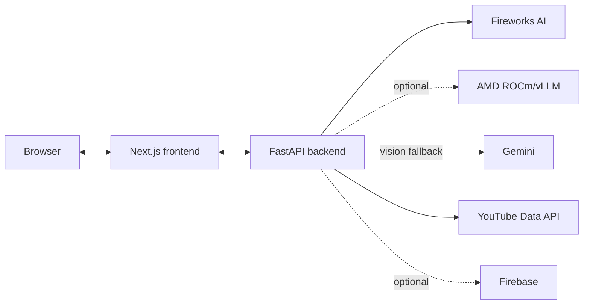

<div align="center">

# ClipContext

**AI-powered video understanding and metadata generation for short-form creators.**

Upload a clip. Get 10 titles, 10 descriptions, and 10 hashtag sets —
independently generated, independently ranked, and grounded in what your
video actually says and shows. Built for the lablab.ai AMD Developer
Hackathon (ACT II, Track 3), with two AI stages running on a real AMD GPU
via ROCm + vLLM.

<!--  -->
*(hero image — landing page screenshot — placeholder)*

[Quickstart](QUICKSTART.md) · [Architecture](docs/Architecture.md) · [AMD Integration](docs/AMD.md) · [Deployment](docs/Deployment.md) · [Docs index](#documentation)

</div>

---

## Overview

ClipContext takes a short creator video (roughly 30 seconds to 2 minutes)
and turns it into platform-ready metadata: ten candidate titles, ten
candidate descriptions, and ten candidate hashtag sets, each pool
independently ranked by an AI discriminator — plus, optionally, a direct
upload of the analyzed video to the creator's own YouTube channel with
whichever candidates they picked.

## The problem

Creators spend real time after editing writing titles, descriptions, and
hashtags — usually disconnected from what the video actually shows and
says, and from what's currently working on the platform. Naively sending
a whole video to a multimodal model for this is also slow and expensive:
most frames in a short clip are temporally redundant, and a single
"best guess" output gives a creator nothing to actually choose between.

## The solution

A sparse, evidence-grounded pipeline: local, free preprocessing
(validation, audio extraction, frame scanning, diversity selection) →
one multimodal understanding call → trend analysis → independent
generation and independent ranking of ten candidates per category. Every
generated candidate has to be consistent with a canonical `VideoContext`
built from the video's actual speech and visuals — trend data shapes
*style*, never invents *facts*. Full write-up:
[docs/Hackathon.md](docs/Hackathon.md).

## Key features

- **Local-first preprocessing.** Video validation, audio extraction, 1 FPS
  frame scanning, visual-quality scoring, and perceptual-diversity frame
  selection all run locally before any paid AI call.
- **Evidence-grounded generation.** Titles/descriptions/hashtags are
  required to trace back to the video's actual transcript and visuals —
  not free-associated from a topic string.
- **Genuine diversity, not ten rewordings.** Each of the 10 candidates per
  pool is generated against a distinct strategy (question, bold claim,
  curiosity gap, number-led, story, technical, emotional, SEO-minimal,
  creator-voice, and more) — see [docs/PROMPT_ENGINEERING.md](docs/PROMPT_ENGINEERING.md).
- **Independent AI ranking.** A second model scores and ranks each
  candidate pool against the video's ground truth and real trend
  benchmarks, with a stated reason per score.
- **Real AMD GPU inference.** Content generation and ranking can each
  independently route to an AMD ROCm/vLLM server instead of Fireworks, with
  automatic truthful fallback and a per-stage audit trail. See
  [docs/AMD.md](docs/AMD.md).
- **Optional accounts and optional YouTube upload.** Both are fully
  optional and architecturally independent — the core workflow (upload,
  process, results) works with zero account/YouTube configuration.
- **Demo mode.** The frontend can be explored end-to-end with a canned
  result and no backend running at all.

## Architecture



This is the 30-second view. For the full system — pipeline stage diagram,
AI provider routing, the two-identity-system auth model, deployment
topology, and repository structure — see
**[docs/Architecture.md](docs/Architecture.md)**.

## Tech stack

| Layer | Technology |
|---|---|
| Frontend | Next.js 14 (App Router), React 18, TypeScript, Tailwind CSS, Framer Motion |
| Backend | FastAPI, Python 3.13, Pydantic |
| Video/audio | OpenCV, FFmpeg, faster-whisper (local transcription) |
| AI — vision & text | Fireworks AI (Kimi vision + text, MiniMax), Google Gemini (vision fallback) |
| AI — GPU compute | AMD ROCm + vLLM (OpenAI-compatible), for content generation & ranking |
| Trend data | YouTube Data API v3 |
| Accounts (optional) | Firebase Authentication + Firestore |
| Video upload (optional) | YouTube Data API v3 (OAuth 2.0) |
| Testing | pytest (backend, fully mocked externals), ESLint + `tsc` (frontend) |

## How it works

1. **Upload** a video through the frontend.
2. **Local preprocessing** — validate, extract audio, scan frames at 1
   FPS, score and select a diverse frame subset. No AI calls yet.
3. **Transcribe** locally with faster-whisper.
4. **Visual analysis** — Fireworks Kimi (or Gemini fallback) describes
   what's visible in temporal windows aligned to the transcript.
5. **Build `VideoContext`** — one canonical, evidence-grounded semantic
   summary of the video.
6. **Trend analysis** — worldwide YouTube trends, plus creator-specific
   trends if a channel handle was given, compiled into a style profile.
7. **Generate** 10 titles, 10 descriptions, 10 hashtag sets — grounded in
   `VideoContext`, styled by the trend profile. Can run on Fireworks or
   AMD GPU.
8. **Rank** each pool independently against the video's ground truth and
   trend benchmarks. Can also run on Fireworks or AMD GPU.
9. **Results** — pick a title, description, and hashtag set (mix and
   match freely — the pools are independent), optionally save the result
   to a ClipContext account, optionally upload the video straight to
   YouTube with your picks.

Full stage-by-stage detail with real JSON shapes:
**[docs/AI-Pipeline.md](docs/AI-Pipeline.md)**.

## Screenshots

<!--  -->
*(landing page — placeholder)*

<!--  -->
*(processing page — placeholder)*

<!--  -->
*(results page, ranked candidates — placeholder)*

<!--  -->
*(end-to-end walkthrough GIF — placeholder)*

**Demo video:** *(link — placeholder, add before hackathon submission)*

## Quickstart

```bash
git clone <your-fork-or-this-repo-url>
cd act2-captioner
make setup                 # venv + pip install + npm ci + copy .env templates
# edit .env: FIREWORKS_API_KEY, YOUTUBE_API_KEY, GEMINI_API_KEY

make backend                # terminal 1 — http://localhost:8000
make frontend                # terminal 2 — http://localhost:3000
```

Full walkthrough, including Docker Compose and the standalone CLI:
**[QUICKSTART.md](QUICKSTART.md)** and **[docs/DeveloperGuide.md](docs/DeveloperGuide.md)**.

## AMD GPU integration

Two AI stages — content generation and ranking — can run on an AMD GPU via
ROCm + vLLM instead of Fireworks, routed per-stage by environment
variable, with automatic truthful fallback and a per-stage audit trail
that the frontend uses to show (or honestly not show) an "AMD GPU
inference" badge. Real hardware, a real measured model-selection
benchmark, and the full networking setup:
**[docs/AMD.md](docs/AMD.md)** · notebook setup log: **[amd/README.md](amd/README.md)**.

## Accounts & YouTube upload

ClipContext account login (optional, Firebase) and "Connect with YouTube"
(optional, raw Google OAuth) are two separate, independent identity
systems — a user is never assumed to be the same person across both. Both
are fully optional; the core workflow needs neither.

- **ClipContext account login** — optional, backed by Firebase
  Authentication. Gates the "save this result" feature; everything else
  (upload, process, results) works with zero Firebase config.
- **"Connect with YouTube"** — optional, a separate raw Google OAuth 2.0
  flow (not Firebase), scoped to upload + read-only access on the
  creator's own channel. Identity is bound to an opaque, HttpOnly
  `cc_session` cookie, never assumed to be the same person as a
  ClipContext account login.
- **Direct YouTube upload** — once connected, a user can upload the
  analyzed video straight to their channel with whichever title/
  description/hashtags they picked. The upload path is always resolved
  server-side from the job ID, never accepted as a client-supplied path;
  upload runs in the background with the frontend polling for progress.

- **[docs/Firebase.md](docs/Firebase.md)** — account login, saved
  artifacts, Firestore setup from scratch.
- **[docs/YouTube.md](docs/YouTube.md)** — OAuth client setup, upload
  flow, Testing-mode restrictions.

## Storage

Two independent storage layers, neither required for the core workflow:

- **Saved artifacts (optional, Firestore).** When signed in to a
  ClipContext account, a user can save a completed generation's picks — the
  selected title/description/hashtags plus the AI understanding/analysis
  behind them — as an "artifact," stored in Cloud Firestore at
  `users/{uid}/artifacts/{artifact_id}`. Saving re-reads the actual result
  server-side rather than trusting client-supplied content, and re-saving
  the same job updates it in place instead of duplicating it. Artifacts
  can be listed, fetched, and deleted, and every route degrades to a
  structured "not configured" response — never a crash — when Firebase
  isn't set up.
- **Raw video & pipeline working files (always, local disk).** The
  uploaded video itself and pipeline caches (frames, transcription,
  visual-analysis intermediates, keyed by job ID / video hash) live on
  local disk under `data/` and `outputs/` (both gitignored). There is no
  cloud object storage (no GCS/S3 bucket) anywhere in this codebase — this
  is also why deployment requires a persistent container host rather than
  serverless (see [Deployment](#deployment) below).

## Deployment

Frontend on Vercel, backend on any persistent container host (Railway,
Render, or plain Docker-on-a-VM — **not** short-lived serverless, since
the pipeline shells out to FFmpeg and writes job artifacts to local disk).
The backend's job/session state is in-memory by design, which caps it at
a single instance until shared state is added — and a small hosting
plan's memory limit is a real, stated constraint for longer videos, not a
hidden one. Full guide, including that tradeoff in detail:
**[docs/Deployment.md](docs/Deployment.md)**.

## Documentation

| Doc | Covers |
|---|---|
| [docs/Architecture.md](docs/Architecture.md) | Full system diagrams — start here |
| [docs/Backend.md](docs/Backend.md) | FastAPI app, job registry, module structure |
| [docs/API.md](docs/API.md) | Every backend endpoint, request/response shapes |
| [docs/AI-Pipeline.md](docs/AI-Pipeline.md) | Every pipeline stage, in order, with real JSON |
| [docs/Frontend.md](docs/Frontend.md) | Next.js pages, contexts, components |
| [docs/AMD.md](docs/AMD.md) | AMD GPU integration deep-dive |
| [docs/Firebase.md](docs/Firebase.md) | Accounts, Firestore, setup from scratch |
| [docs/YouTube.md](docs/YouTube.md) | OAuth setup, upload flow |
| [docs/Deployment.md](docs/Deployment.md) | Vercel, Railway/Render/Docker, all the gotchas |
| [docs/Environment.md](docs/Environment.md) | Every environment variable |
| [docs/DeveloperGuide.md](docs/DeveloperGuide.md) | Local dev, testing, conventions |
| [docs/Troubleshooting.md](docs/Troubleshooting.md) | Fixes for common errors, by area |
| [docs/PROMPT_ENGINEERING.md](docs/PROMPT_ENGINEERING.md) | Every AI prompt, and why it's written the way it is |
| [docs/Hackathon.md](docs/Hackathon.md) | Submission narrative, judging-criteria mapping |
| [docs/DEMO_SCRIPT.md](docs/DEMO_SCRIPT.md) | Timed 3-minute live demo script |
| [docs/DEMO_CHECKLIST.md](docs/DEMO_CHECKLIST.md) | Pre-flight checklist before presenting |
| [docs/CHEATSHEET.md](docs/CHEATSHEET.md) | Commands, URLs, env vars — no explanation |
| [QUICKSTART.md](QUICKSTART.md) | One-page setup guide |
| [CONTRIBUTING.md](CONTRIBUTING.md) | How to contribute |

## Repository structure

```
main.py            Standalone CLI over the pipeline service
src/                FastAPI backend, pipeline, AI providers, YouTube, Firebase
frontend/           Next.js app
amd/                AMD ROCm/vLLM setup, diagnostics, benchmark
docs/               Full documentation set (table above)
tests/              pytest suite (all external calls mocked)
```

Full annotated tree: [docs/Architecture.md § Repository structure](docs/Architecture.md#repository-structure).

## Testing

```bash
make test    # pytest — all external calls (Fireworks, AMD vLLM, YouTube, Firebase) mocked
```

Real AMD hardware validation is separate and intentional — see
[amd/README.md](amd/README.md).

## Known limitations

Stated plainly, not hidden: job and YouTube-session state are in-memory
and single-instance by design; a small hosting plan's memory ceiling is a
real constraint for longer videos (documented mitigations exist); the AMD
notebook allocation is time-bound, not permanent infrastructure. Full list
with rationale: [docs/Deployment.md](docs/Deployment.md) and
[docs/Hackathon.md § Known limitations](docs/Hackathon.md#known-limitations-stated-plainly).

## Future work

- Shared state (Redis or a database) for the job registry and YouTube
  session/token stores, to allow horizontal backend scaling.
- Category selector and additional metadata fields for the YouTube upload
  flow (currently a fixed default category).
- Support for additional short-form platforms beyond YouTube trend data.
- Incremental caching within the visual-analysis stage, so a retry after a
  partial failure doesn't re-analyze already-completed windows.

## Contributing

Contributions are welcome — see **[CONTRIBUTING.md](CONTRIBUTING.md)** for
setup, conventions, and the PR process. Please also read
[CODE_OF_CONDUCT.md](CODE_OF_CONDUCT.md). Security issues: see
[SECURITY.md](SECURITY.md) — please don't file those as public issues.

## Contributors

<!-- Add contributors here, e.g. via https://github.com/all-contributors or a manual list -->

- *(add contributors)*

## Acknowledgements

- Built for the **lablab.ai AMD Developer Hackathon** (ACT II, Track 3).
- AMD GPU compute via **ROCm** and **vLLM**.
- AI inference via **Fireworks AI** (Kimi, MiniMax) and **Google Gemini**.
- Trend data via the **YouTube Data API v3**.

## License

[MIT](LICENSE).
