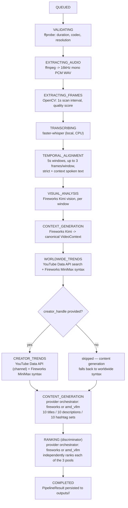

# AI Pipeline

`src/pipeline/runner.py`'s `run_pipeline()` is the single implementation of
ClipContext's video-to-metadata pipeline — both `main.py` (CLI) and
`src/api/jobs.py` (API background job) call this one function. This
document walks through every stage in the exact order `run_pipeline()`
executes them, what each stage actually calls, and the real shape of its
output. For how a job's progress through these stages is exposed over
HTTP, see [Backend.md](Backend.md) and [API.md](API.md).

## Stage sequence



`STAGE_PROGRESS` in `src/pipeline/schemas.py` maps each `PipelineStage` to
a fixed 0-100 progress value reported to the caller's `progress_callback`
(`QUEUED`=0, `VALIDATING`=5, `EXTRACTING_AUDIO`=12, `EXTRACTING_FRAMES`=20,
`TRANSCRIBING`=32, `TEMPORAL_ALIGNMENT`=40, `VISUAL_ANALYSIS`=55,
`CONTEXT_GENERATION`=68, `WORLDWIDE_TRENDS`=78, `CREATOR_TRENDS`=86,
`CONTENT_GENERATION`=93, `RANKING`=98, `COMPLETED`=100).

## Caching

`src/pipeline/paths.py` splits pipeline artifacts into two tiers:

- **Video-level cache**, keyed by a SHA-256 hash of the video's bytes
  (`outputs/_cache/<video_hash>/`): transcription, visual timeline,
  `VideoContext`, and the derived `caption_context`. These don't depend on
  creator handle or platform, so re-uploading the same video bytes reuses
  them — `_get_transcription()`, `_get_visual_timeline()`, and
  `_get_video_context()` in `runner.py` all check this cache before calling
  their respective AI stage.
- **Job-level output**, keyed by `job_id` (which folds in `video_hash`,
  `platform`, and `creator_handle`): trends, syntax, generated content, and
  the discriminator audit report. These depend on who's asking and for
  which platform, so they're recomputed per job even for a cached video.

## Stage 1 — `VALIDATING`

**What it does**: `src/video/validator.py`'s `validate_video()` runs
`ffprobe` and checks the video is between 5 and 120 seconds
(`MIN_DURATION` / `MAX_DURATION`) and has a video stream. Raises
`ValueError` (translated to `PipelineError`) otherwise.
**Output**: a plain dict, not persisted:
```json
{ "duration": 42.3, "width": 1080, "height": 1920, "codec": "h264" }
```

## Stage 2 — `EXTRACTING_AUDIO`

**What it does**: `src/video/audio.py`'s `extract_audio()` shells out to
`ffmpeg -vn -ac 1 -ar 16000 -c:a pcm_s16le`, producing a mono 16kHz PCM WAV
— the format `faster-whisper` expects. Written to
`data/audio/<video_hash>/audio.wav`.

## Stage 3 — `EXTRACTING_FRAMES`

**What it does**: `src/video/frames.py`'s `extract_candidate_frames()`
opens the video with OpenCV and samples one frame per second
(`scan_interval=1.0`), resizing to a max width of 512px
(`src/video/frame_selector.py`'s `MAX_FRAME_WIDTH`) and scoring each on a
weighted blend of brightness, Canny edge density, and contrast
(`calculate_frame_score`: 30% brightness, 35% edges, 35% contrast).
**Output** (one entry per sampled second, all candidates — selection into
windows happens in Stage 5):
```json
{ "timestamp": 4.0, "path": "data/frames/<hash>/candidate_004_4.0s.jpg", "score": 0.6123 }
```

## Stage 4 — `TRANSCRIBING`

**What it does**: `src/ai/transcriber.py`'s `transcribe_audio()` runs
**faster-whisper** locally on CPU (`device="cpu", compute_type="int8"`),
with `beam_size=5` and voice-activity-detection filtering (`vad_filter=True`).
The model size defaults to `"tiny"` (`DEFAULT_WHISPER_MODEL_SIZE`), overridable
via `WHISPER_MODEL_SIZE` — the module's own comment explains this default was
forced down from `"small"` and then `"base"` after both intermittently
OOM-killed the Railway deployment; `"tiny"` reduces but does not eliminate
the risk. Result is cached at `outputs/_cache/<video_hash>/transcription.json`.
**Output**:
```json
{
  "language": "en",
  "language_probability": 0.9931,
  "text": "So I finally built my first espresso setup...",
  "segments": [
    { "start": 0.0, "end": 3.42, "text": "So I finally built my first espresso setup." }
  ]
}
```

## Stage 5 — `TEMPORAL_ALIGNMENT`

**What it does**: `src/ai/temporal_alignment.py`'s `build_temporal_windows()`
splits the video into fixed 5-second windows (`WINDOW_SIZE_SECONDS`). For
each window it:
- Selects up to 3 frames (`MAX_FRAMES_PER_WINDOW`) via
  `src/video/frame_selector.py`'s `select_window_frames()`, a greedy
  quality/diversity tradeoff (55% frame quality score, 45% visual
  difference from already-selected frames in the window, measured as mean
  absolute pixel difference on a 32×32 grayscale thumbnail).
- Computes `strict_spoken_text` — only transcript segments whose midpoint
  falls inside the window.
- Computes `context_spoken_text` — transcript segments that merely overlap
  the window at all (a superset of strict, used to give the visual-analysis
  prompt more surrounding context without asserting it as "spoken in this
  exact window").

**Output** (per window, not directly persisted — feeds Stage 6 in memory):
```json
{
  "start_time": 5.0,
  "end_time": 10.0,
  "frames": [{ "timestamp": 6.0, "path": "...", "score": 0.71 }],
  "strict_spoken_text": "I spent about eighty dollars total.",
  "context_spoken_text": "...and I spent about eighty dollars total on this whole thing."
}
```

## Stage 6 — `VISUAL_ANALYSIS`

**What it does**: `src/ai/fireworks/multimodal.py`'s
`analyse_visual_window()` sends each window's selected frames (base64
data-URLs) plus a strict "describe only visible evidence" prompt to
**Fireworks-hosted Kimi** (`accounts/fireworks/routers/kimi-k2p6-turbo`,
`src/ai/fireworks/client.py`'s `MODEL_ID`), `temperature=0.0`. Runs once
per window, sequentially, reporting progress per window
(`"Analysing visual window {i}/{n}"`). Windows with no frames skip the API
call and return a fixed "No sampled visual frames available" analysis.
Result is cached as a whole (all windows) at
`outputs/_cache/<video_hash>/visual_timeline.json`.

A parallel Gemini-based implementation exists at `src/ai/vision/gemma.py`
(`analyse_visual_window()` against `gemini-3.1-flash-lite`) but **is not
called anywhere in `run_pipeline()`** — it is unused/reserved code, not an
active fallback path, despite `GEMINI_API_KEY` being a required startup
environment variable. If you're looking for where visual analysis actually
happens, it's `src/ai/fireworks/multimodal.py`, not this module.

**Output** — `VisualWindowAnalysis` (`src/models/visual_window.py`), one
per window:
```json
{
  "description": "A hand pulls a shot of espresso; steam rises from the portafilter.",
  "subjects": ["hand", "espresso machine"],
  "actions": ["pulling a shot"],
  "objects": ["portafilter", "espresso cup"],
  "visible_text": [],
  "setting": "home kitchen counter",
  "visual_mood": "focused, methodical"
}
```

## Stage 7 — `CONTEXT_GENERATION`

**What it does**: `src/ai/context_builder.py`'s `build_video_context()`
sends the full formatted transcript and the full visual timeline (all
windows) to Fireworks Kimi in one call (`temperature=0.0`,
`max_tokens=3000`), instructed to fuse speech and visual evidence into one
canonical semantic representation — explicitly *not* a caption yet. The
prompt enforces evidence discipline (no invented causality, no unestablished
identity claims, uncertainties kept in a dedicated field) since this
`VideoContext` is the *only* evidence the downstream copywriter stage sees;
it never re-reads the transcript or re-analyzes frames. Cached at
`outputs/_cache/<video_hash>/video_context.json`.

A 4-field summary (`topic`, `content_type`, `multimodal_summary`,
`core_message`) is also extracted and saved separately as
`outputs/_cache/<video_hash>/caption_context.json` — this smaller
`VideoContextSummary` is what ends up in the final `PipelineResult` and in
saved artifacts, while the full `VideoContext` (below) is what
`CONTENT_GENERATION` actually reads for generation.

**Output** — `VideoContext` (`src/models/video_context.py`):
```json
{
  "topic": "Building a budget home espresso setup",
  "content_type": "tutorial",
  "core_message": "A quality espresso setup is achievable on a tight budget with the right used gear.",
  "transcript_summary": "The creator walks through the machine, grinder, and accessories they bought secondhand for under $80.",
  "visual_summary": "Close-up shots of pulling shots and unboxing gear on a kitchen counter.",
  "multimodal_summary": "Speech narrates cost decisions while visuals show the actual gear and technique in use.",
  "key_moments": [
    { "start_time": 5.0, "end_time": 10.0, "spoken_content": "I spent about eighty dollars total.", "visual_content": "Hand pulling a shot, steam visible.", "significance": "States the core budget hook." }
  ],
  "key_entities": ["espresso machine", "portafilter"],
  "visible_text": [],
  "emotional_arc": "curiosity -> mild tension over cost -> satisfaction",
  "visual_style": "handheld, close-up, natural kitchen lighting",
  "technical_level": "beginner",
  "target_audience_signals": ["budget-conscious home coffee beginners"],
  "captionable_details": ["Entire setup assembled from used gear for under $80"],
  "uncertainties": ["Exact machine model is not confirmed on screen"]
}
```

## Stage 8 — `WORLDWIDE_TRENDS`

**What it does**: `src/trends/worldwide_analyzer.py`'s
`run_worldwide_analysis()`:
1. `generate_keywords_from_summary()` — asks Fireworks MiniMax
   (`accounts/fireworks/models/minimax-m3`, a locally-defined
   `MINIMAX_MODEL_ID` distinct from the MiniMax id used elsewhere — see
   "Model naming inconsistency" below) for a 2-4 word YouTube search phrase
   derived from `caption_context`'s `multimodal_summary` + `core_message`.
2. `fetch_worldwide_trends()` — queries the **YouTube Data API v3**
   (`search.list` + `videos.list`) for that phrase, keeping only videos
   30-120 seconds long, up to `target_count` (30).
3. `categorize_trends()` — computes `like_ratio` / `comment_ratio` and
   clusters the results with scikit-learn `KMeans` (up to 3 clusters) on
   `[views, like_ratio, comment_ratio]`.
4. `compile_syntax_payload()` — takes the top 5 videos from the
   highest-average-views cluster and asks Fireworks MiniMax to extract a
   reusable style profile from them.

Raw clustered data is written to `outputs/<job_id>/trends/w_trends.json`;
the style profile to `outputs/<job_id>/syntax/w_syntax.json`.

**Output** (`w_trends.json`, one row per matched video):
```json
{ "video_id": "abc123", "clean_title": "MY $80 ESPRESSO SETUP", "extracted_hashtags": ["#espresso"], "views": 812000, "likes": 54000, "like_ratio": 0.0665, "comment_ratio": 0.0012, "duration": 58.0, "cluster_id": 1 }
```
**Output** (`w_syntax.json`):
```json
{
  "syntax_blueprint": { "titles": "Short, dollar-amount hook first, all-caps emphasis word", "descriptions": "1-2 lines + CTA to follow", "hashtags": "3-5 tags, one broad + niche mix" },
  "seo_vocabulary": ["espresso", "budget", "home setup"],
  "adjectives": ["scrappy", "satisfying", "no-nonsense"]
}
```

## Stage 9 — `CREATOR_TRENDS` (optional)

**What it does**: Runs only if `creator_handle` was provided when the job
was created; otherwise this stage is reported as skipped and content
generation falls back to the worldwide syntax profile.
`src/trends/trend_analyzer.py`'s `run_creator_analysis()` resolves the
handle to a channel id (`channels.list(forHandle=...)`, falling back to
`search.list`), pulls that channel's top-viewed 30-120s videos
(`fetch_creator_trends()`), clusters them the same way as Stage 8, and
compiles a per-creator style profile via Fireworks MiniMax — here using
`accounts/fireworks/models/minimax-m2p7` (`MINMAX_ID` from
`src/ai/fireworks/client.py`, a **different** MiniMax id than
`worldwide_analyzer.py`'s local constant; see below). Written to
`outputs/<job_id>/trends/yt_trends.json` and
`outputs/<job_id>/syntax/yt_syntax.json`, same shapes as Stage 8's outputs.

## Which syntax profile feeds generation

`run_pipeline()` picks the syntax source for Stage 10 with one rule: if
`platform == "youtube"` **and** a creator handle was given, use the
creator's syntax (`yt_syntax.json`); otherwise use the worldwide syntax
(`w_syntax.json`). This is the only place platform affects pipeline
behavior.

## Stage 10 — `CONTENT_GENERATION`

**What it does**: `src/ai/content_generator.py`'s `generate_content()`
builds a prompt from the full `VideoContext` (not the 4-field
`caption_context` — a code comment in `runner.py` notes this distinction
was deliberate: the smaller summary was "silently starving" generation of
evidence) plus the chosen platform syntax, then calls
`src/ai/providers/orchestrator.py`'s `run_structured_stage()` with
`schema_model=GeneratedContent`, requesting exactly 10 titles / 10
descriptions / 10 hashtag sets in fixed lane/format/strategy order,
`temperature=0.8`, `max_tokens=6000`. This is one of the two stages
routable to AMD vLLM — see "Provider abstraction" below. Default model on
Fireworks is `accounts/fireworks/routers/kimi-k2p6-turbo`
(`DEFAULT_MODEL`). Written to `outputs/<job_id>/generated_content.json`.

**Output** — `GeneratedContent` (`src/models/generated_content.py`),
pydantic-validated to require exactly 10 sequential ids 1-10 per pool:
```json
{
  "titles": [{ "id": 1, "text": "I Spent $80 On My First Espresso Setup" }],
  "descriptions": [{ "id": 1, "text": "Full breakdown of every piece of gear, all bought used..." }],
  "hashtags": [{ "id": 1, "tags": ["#espresso", "#coffee", "#budget"] }]
}
```

## Stage 11 — `RANKING` (discriminator)

**What it does**: `src/models/discriminator/discriminator.py`'s
`run_discriminator()` loads the `VideoContext`, the worldwide trend
benchmarks (top cluster's average views/like ratio/sample titles/tags —
falling back to hardcoded defaults if trend data is malformed), and the
generated candidate pools, then calls `run_structured_stage()` again with
`schema_model=DiscriminatorResult`, `temperature=0.1`, `max_tokens=8000`.
The system prompt (`src/models/discriminator/d_prompt.txt`) instructs the
model to rank titles, descriptions, and hashtag sets **independently** —
rank 1 in `titles` implies nothing about rank 1 in `descriptions`. This is
the second (and last) stage routable to AMD vLLM. Fireworks model is
`accounts/fireworks/models/minimax-m2p7` (`MINMAX_ID`). Written to
`outputs/<job_id>/audit_report.json`.

**Output** — `DiscriminatorResult` (`src/models/discriminator/schemas.py`),
pydantic-validated to require ranks 1-10 with no duplicates per pool:
```json
{
  "titles": [{ "id": 3, "rank": 1, "score": 91, "reason": "Leads with the specific dollar figure, which the trend data shows outperforms generic hooks." }],
  "descriptions": [{ "id": 1, "rank": 1, "score": 84, "reason": "..." }],
  "hashtags": [{ "id": 7, "rank": 1, "score": 88, "reason": "..." }]
}
```

## Stage 12 — `COMPLETED`

`run_pipeline()` returns a `PipelineResult` (`src/pipeline/schemas.py`):
```json
{
  "job_id": "3f9c2a1b7e4d5601",
  "video_context": { "topic": "...", "content_type": "...", "multimodal_summary": "...", "core_message": "..." },
  "generated_content": { "titles": [...], "descriptions": [...], "hashtags": [...] },
  "rankings": { "titles": [...], "descriptions": [...], "hashtags": [...] },
  "ai_audit": [
    { "stage": "content_generation", "provider_requested": "fireworks", "provider_used": "fireworks", "model": "accounts/fireworks/routers/kimi-k2p6-turbo", "hardware": "Fireworks-hosted inference", "latency_ms": 4231.7, "fallback_used": false, "fallback_reason": null },
    { "stage": "discriminator", "provider_requested": "fireworks", "provider_used": "fireworks", "model": "accounts/fireworks/models/minimax-m2p7", "hardware": "Fireworks-hosted inference", "latency_ms": 2870.2, "fallback_used": false, "fallback_reason": null }
  ]
}
```
This is exactly what lands in `JobStatusResponse.result` (see
[API.md](API.md)) and in a saved artifact's body. `ai_audit` always has
exactly two entries — one per stage that goes through the provider
orchestrator (see below); visual analysis, context generation, and trend
syntax compilation call Fireworks directly and are not part of this audit
trail or the AMD routing.

`outputs/<job_id>/ai_provider_audit.json` persists the same `ai_audit` list
to disk independently of the in-memory job registry.

## Provider abstraction: routing `content_generation` and `discriminator`

This is the AMD hackathon integration point. Only two stages —
`CONTENT_GENERATION` and `RANKING` — are text-only, structured-JSON calls,
and only these two go through `src/ai/providers/`:

- **`base.py`** — `AIProvider` ABC: `is_configured()`, `chat_completion()`
  (raises `ProviderUnavailableError` for anything that should trigger
  fallback — connection failure, timeout, 5xx — or `ProviderResponseError`
  for an unusable response — empty content, non-retryable 4xx, or content
  that never became valid JSON), and a best-effort `health_check()`.
- **`fireworks_provider.py`** / **`amd_vllm.py`** — concrete
  implementations. `AmdVllmProvider` targets an OpenAI-compatible vLLM
  server (`AMD_VLLM_BASE_URL`, `AMD_VLLM_MODEL`, `AMD_VLLM_API_KEY`,
  `AMD_VLLM_TIMEOUT_SECONDS`, default 240s) and tries
  `response_format: json_schema` first, falling back to plain
  `json_object` within the same attempt if the server rejects the schema
  request.
- **`registry.py`** — `get_stage_providers(stage)` reads
  `CONTENT_GENERATION_PROVIDER` / `DISCRIMINATOR_PROVIDER` (default
  `"fireworks"`) and `..._FALLBACK_PROVIDER` (defaults to `"fireworks"`
  whenever the primary isn't already Fireworks) from the environment — no
  code change needed to route a stage to AMD.
- **`orchestrator.py`** — `run_structured_stage()` is the single place
  that turns `(system_prompt, user_prompt, Pydantic schema)` into a
  validated model instance regardless of provider. It tries the primary
  provider, falls back to the secondary on `ProviderUnavailableError` /
  `ProviderResponseError`, and retries once (`MAX_REPAIR_ATTEMPTS = 1`) with
  the validation error fed back to the model if the JSON doesn't match the
  schema. It always returns a `StageAudit` — `provider_requested` may
  legitimately differ from `provider_used` when fallback occurred, and
  `fallback_used` / `fallback_reason` record why. Per its own docstring
  note (echoed in `src/pipeline/schemas.py`'s `StageAiAudit`): **the
  frontend must only show an "AMD inference" indicator when
  `provider_used == "amd_vllm"`**, never based on `provider_requested`
  alone, since a run can silently fall back to Fireworks.

Hardware/AMD setup, model selection, and benchmark notes are covered in
[AMD.md](AMD.md), not here.

## Note: two different MiniMax model ids

`src/trends/trend_analyzer.py` (creator trends) and
`src/models/discriminator/discriminator.py` both import `MINMAX_ID`
(`accounts/fireworks/models/minimax-m2p7`) from
`src/ai/fireworks/client.py`. `src/trends/worldwide_analyzer.py` instead
defines its own local `MINIMAX_MODEL_ID = "accounts/fireworks/models/minimax-m3"`
and does not import the shared constant. Both are real, currently-used
model ids on Fireworks — this is a genuine inconsistency in the codebase,
not a typo introduced by this document; verify against your own Fireworks
account before assuming they should be unified.

## See also

- [Backend.md](Backend.md) — how a job's progress through these stages is
  tracked and exposed over HTTP.
- [API.md](API.md) — the `JobStatusResponse.result` field is exactly the
  `PipelineResult` described above.
- [AMD.md](AMD.md) — AMD ROCm/vLLM hardware setup and benchmarks.
