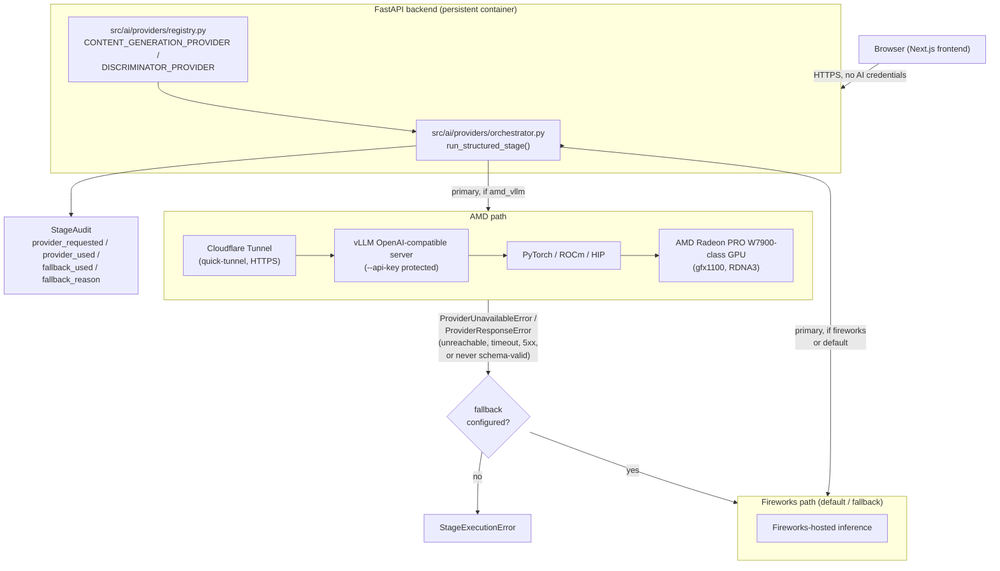

# AMD GPU Integration (ROCm + vLLM)

This document is the canonical, polished reference for how ClipContext
integrates AMD GPU inference for its lablab.ai **AMD Developer Hackathon
(ACT II, Track 3)** submission. It describes the integration from the
application/code side. For the hands-on notebook setup log — real hardware
diagnostics, the model-selection benchmark run, and the Cloudflare Tunnel
networking steps as actually executed — see [`amd/README.md`](../amd/README.md),
which this document deliberately does not duplicate.

## Why this integration is real, not cosmetic

Three properties make this more than a provider name swapped into a config
file:

1. **The backend is the only thing that ever talks to the AMD endpoint.**
   `AMD_VLLM_BASE_URL` is read exclusively in
   [`src/ai/providers/amd_vllm.py`](../src/ai/providers/amd_vllm.py), which
   runs server-side inside the FastAPI process. The browser calls the
   ClipContext backend's own API; it has no way to reach the AMD notebook
   directly, and no AMD credential or URL is ever shipped to the frontend
   bundle.
2. **The AMD endpoint is not exposed as a bare public endpoint on its own.**
   The notebook sits behind an isolated internal proxy with no direct public
   port (see [Networking](#networking-cloudflare-tunnel) below); the only
   route out is a Cloudflare Tunnel, and the vLLM server itself is started
   with `--api-key` so the tunnel URL alone is not sufficient to use it.
3. **Model selection was based on real measured VRAM/throughput on the
   actual allocated GPU, not guessed.** See
   [Model selection and benchmark numbers](#model-selection-and-benchmark-numbers).

## Architecture

Two ClipContext pipeline stages are AMD-eligible: `content_generation`
(the 10 titles / 10 descriptions / 10 hashtag-set pool) and `discriminator`
(ranking those pools). Both are text-only and produce structured JSON
validated against a Pydantic schema, and both already spoke to an
OpenAI-compatible client before this integration existed — so pointing
either at a second OpenAI-compatible server was a provider swap, not a
pipeline rewrite. Visual understanding and `VideoContext` synthesis require
image input and are not AMD-eligible: the notebook's vLLM instance serves
one text model, not a vision-language model.



The audit record above is what makes fallback truthful rather than silent —
see [Fallback and audit trail](#fallback-and-audit-trail).

## Provider selection and routing

Per-stage routing is entirely environment-driven, in
[`src/ai/providers/registry.py`](../src/ai/providers/registry.py):

```
CONTENT_GENERATION_PROVIDER=amd_vllm
CONTENT_GENERATION_FALLBACK_PROVIDER=fireworks
DISCRIMINATOR_PROVIDER=amd_vllm
DISCRIMINATOR_FALLBACK_PROVIDER=fireworks
```

Both `CONTENT_GENERATION_PROVIDER` and `DISCRIMINATOR_PROVIDER` default to
`"fireworks"` with no fallback configured, so leaving all four unset
reproduces ClipContext's original, pre-AMD behavior exactly —
`get_stage_providers()` only derives a non-empty fallback default
(`"fireworks"`) when the primary provider for that stage is something other
than `"fireworks"` itself.

The demo default ships with only `CONTENT_GENERATION_PROVIDER=amd_vllm` set.
`DISCRIMINATOR_PROVIDER` is left on Fireworks because its `max_tokens`
ceiling is higher, meaning its worst-case AMD latency would be worse than
`content_generation`'s — keeping it on Fireworks means a live demo only
waits on the AMD path once. Both stages are fully code-supported on AMD;
set `DISCRIMINATOR_PROVIDER=amd_vllm` too for an extended technical
walkthrough outside a timed demo.

[`src/ai/providers/orchestrator.py`](../src/ai/providers/orchestrator.py)
(`run_structured_stage()`) is the single place that turns
`(system prompt, user prompt, Pydantic schema)` into a validated model
instance regardless of which provider answers. It:

- Tries the primary provider first, with up to one repair-retry round trip
  if the response comes back schema-invalid JSON (`MAX_REPAIR_ATTEMPTS = 1`).
- Falls back to the configured fallback provider if the primary is
  unreachable (`ProviderUnavailableError`) or never returns schema-valid
  output even after the repair retry (`ProviderResponseError`).
- Raises `StageExecutionError` only if every configured provider in the
  chain fails.

[`src/ai/providers/amd_vllm.py`](../src/ai/providers/amd_vllm.py)
(`AmdVllmProvider`) wraps the AMD server as a plain OpenAI-compatible
client (`openai.OpenAI(base_url=AMD_VLLM_BASE_URL, ...)`). It tries
`response_format: json_schema` first, and if the server rejects that shape
with a 4xx it retries once with the looser `json_object` mode within the
same call — because vLLM's guaranteed constrained-decoding support varies
by installed backend and model, this provider does not assume `json_schema`
is honored, and relies on the orchestrator's schema-validation retry loop
as the actual correctness backstop either way. The client timeout defaults
to 240 seconds (`AMD_VLLM_TIMEOUT_SECONDS`), sized with headroom above the
72.2s worst-case latency actually measured against the 14B model on this
GPU (see below).

## Model selection and benchmark numbers

These numbers are reused as-measured from a real `amd/benchmark_amd.py` run
against the allocated notebook — see
[`amd/README.md` § Model selection](../amd/README.md#model-selection) for
the full narrative. They are not re-derived or estimated here.

**Allocated hardware** (from `amd/verify_rocm.py`):

| | |
|---|---|
| GPU | AMD Radeon PRO W7900-class, `gfx1100` (RDNA3), single card |
| VRAM | 48 GiB |
| ROCm / HIP | 7.2.53211 |
| PyTorch | 2.9.1 (ROCm build) |
| vLLM | 0.16.1.dev0 (ROCm721 build) |
| Free disk | ~93 GiB under `/workspace` |
| RAM | 503 GiB (485 GiB free) |

**Chosen model: `Qwen/Qwen2.5-7B-Instruct`**, revised down from
`Qwen2.5-14B-Instruct` after a real throughput measurement:

| Model | Latency | Completion tokens | Throughput |
|---|---|---|---|
| Qwen2.5-14B-Instruct | 72.2s | 978 | 13.5 tok/s |
| Qwen2.5-7B-Instruct | 38.5s | 1219 | 31.6 tok/s |

vLLM auto-selected the Triton Attention backend for this card — vLLM's most
optimized ROCm attention kernels target CDNA datacenter cards (MI200/MI300),
not this card's RDNA3 (`gfx1100`) architecture, which explains the ceiling.
7B gives roughly 2.3x the throughput of 14B on the same hardware while
remaining real GPU inference on a non-trivial model, and was chosen for a
live demo over a slower, marginally higher-quality 14B run. Full rationale,
including why Gemma was rejected (gated on Hugging Face) and why an
AWQ/GPTQ int4-quantized 14B build was set aside (unproven quantized-kernel
support on `gfx1100` this close to a demo), is in
[`amd/README.md`](../amd/README.md#model-selection).

Server launch configuration (`amd/start_vllm.sh`):

```bash
export AMD_VLLM_MODEL="Qwen/Qwen2.5-7B-Instruct"
export MAX_MODEL_LEN=16384       # native context is 32K; capped to what the stages actually use
export GPU_MEMORY_UTILIZATION=0.88
export AMD_VLLM_API_KEY="<a-random-string-you-generate>"
```

## Scripts in `amd/`

| File | Purpose |
|---|---|
| [`verify_rocm.py`](../amd/verify_rocm.py) | Run first, on the notebook. Confirms `rocminfo`/`rocm-smi`/PyTorch/vLLM actually see the GPU before anything else proceeds. Prints only non-secret diagnostics. |
| [`start_vllm.sh`](../amd/start_vllm.sh) | Starts `vllm.entrypoints.openai.api_server` with explicit, env-driven flags (`--model`, `--host`, `--port`, `--gpu-memory-utilization`, optionally `--max-model-len` / `--api-key`). Warns loudly to stderr if `AMD_VLLM_API_KEY` is unset. |
| [`smoke_test.py`](../amd/smoke_test.py) | Run from any machine that can reach the server (not necessarily the notebook). Confirms a plain chat completion and a structured-JSON completion both work, and reports which `response_format` the server actually honored. |
| [`benchmark_amd.py`](../amd/benchmark_amd.py) | Runs the real `content_generation` system prompt, prompt builder, and `GeneratedContent` Pydantic schema against `AMD_VLLM_BASE_URL` directly via `AmdVllmProvider`, and reports real latency/token/validation numbers — refuses to run and fabricate nothing if the provider isn't configured. |
| [`requirements-amd.txt`](../amd/requirements-amd.txt) | Not a pip install target — documents that torch/vllm/ROCm userspace libraries are preinstalled in the notebook image and should not be reinstalled over. |

## Networking (Cloudflare Tunnel)

The allocated notebook has no direct public port — it sits behind an
isolated internal proxy (`radeon-global.anruicloud.com`) with only Jupyter's
own HTTP(S) proxy exposed, confirmed by direct testing. `AMD_VLLM_BASE_URL`
therefore cannot point at the notebook directly; the chosen mechanism is a
**Cloudflare Tunnel in quick-tunnel mode** (no Cloudflare account required,
appropriate for a time-boxed hackathon demo, not long-lived infrastructure):

```bash
tmux new -s tunnel
curl -L https://github.com/cloudflare/cloudflared/releases/latest/download/cloudflared-linux-amd64 -o cloudflared
chmod +x cloudflared
./cloudflared tunnel --url http://localhost:8000
```

This prints an ephemeral URL like `https://random-two-words.trycloudflare.com`
— a plain HTTPS reverse proxy with no authentication layer of its own, which
is exactly why `AMD_VLLM_API_KEY` (set on the vLLM server via `--api-key`)
is the thing actually protecting the endpoint. The URL changes every time
`cloudflared` restarts and carries no uptime SLA — see
[`amd/README.md` § Network access](../amd/README.md#network-access) for the
full tradeoff discussion and the verification `curl` command to run before
wiring a fresh URL into the deployed backend. If the tunnel drops mid-demo,
that is exactly the scenario the Fireworks fallback exists for: the pipeline
keeps working, and the audit trail records it honestly (see below).

## Fallback and audit trail

`run_structured_stage()` is the only source of truth for which provider
actually handled a stage; the frontend is never allowed to infer this from
what was merely *requested*. On fallback, the audit dict recorded per stage
looks like:

```json
{
  "stage": "content_generation",
  "provider_requested": "amd_vllm",
  "provider_used": "fireworks",
  "model": "accounts/fireworks/models/...",
  "hardware": "Fireworks-hosted inference",
  "latency_ms": 4213.7,
  "fallback_used": true,
  "fallback_reason": "provider_unreachable"
}
```

`fallback_reason` is one of `provider_unreachable`, `invalid_structured_output`,
`provider_not_configured`, or `unknown_provider`. This audit is attached to
each completed job's result (`ai_audit`, persisted to
`outputs/<job_id>/ai_provider_audit.json`), and the frontend's
`AIUnderstandingCard` component only renders an "AMD GPU inference"
indicator when `provider_used === "amd_vllm"` for that stage — never based
on `provider_requested` alone, and never for a stage that fell back.

## `GET /api/providers/status`

Defined in [`src/api/routes.py`](../src/api/routes.py) and backed by
[`src/ai/providers/health.py`](../src/ai/providers/health.py)
(`get_ai_provider_status()`), returning the `ProviderStatusResponse` shape
declared in [`src/api/schemas.py`](../src/api/schemas.py)
(`{"stages": dict[str, Any], "providers": dict[str, Any]}`). Checking AMD
reachability makes a live network call to the configured endpoint, which is
why this is a separate route from `GET /health` rather than folded into the
liveness check platforms poll frequently.

```bash
curl https://<deployed-backend>/api/providers/status
```

```json
{
  "stages": {
    "content_generation": {
      "provider_requested": "amd_vllm",
      "fallback_provider": "fireworks"
    },
    "discriminator": {
      "provider_requested": "fireworks",
      "fallback_provider": null
    }
  },
  "providers": {
    "amd_vllm": {
      "configured": true,
      "reachable": true,
      "model": "Qwen/Qwen2.5-7B-Instruct",
      "model_loaded": true
    },
    "fireworks": {
      "configured": true,
      "reachable": null
    }
  }
}
```

Note `fireworks`'s `reachable` is always `null` — `FireworksProvider.health_check()`
only reports whether `FIREWORKS_API_KEY` is set, deliberately not making a
live call for a stable external vendor on every status check. `amd_vllm`'s
health check does make a live `models.list()` call and reports `model_loaded`
by checking whether the configured `AMD_VLLM_MODEL` is present in the
response. This endpoint never returns API keys, tokens, or the AMD endpoint
URL — only provider name, configured/reachable booleans, model id, and a
coarse error category on failure.

## Starting, stopping, and resuming the notebook session

AMD AI Notebook GPU allocations are time-bound, which is a real operational
constraint for anyone with limited GPU hours. The practical workflow,
following [`amd/README.md`](../amd/README.md#setup-on-the-amd-ai-notebook):

- **Start**: request the notebook (ROCm 7.2 + vLLM 0.16.0 + PyTorch 2.9),
  run `verify_rocm.py`, then `bash amd/start_vllm.sh` with
  `AMD_VLLM_MODEL`/`MAX_MODEL_LEN`/`GPU_MEMORY_UTILIZATION`/`AMD_VLLM_API_KEY`
  exported, in its own foreground terminal/tmux session (`vllm`). Start the
  Cloudflare Tunnel in a second, separate tmux session (`tunnel`).
- **Pause/stop**: `Ctrl+C` the `start_vllm.sh` session (or
  `tmux kill-session -t vllm`) to free the GPU — only one model can be
  loaded at a time on a single card, so this is required before starting a
  different model size. Stopping `cloudflared` similarly frees that
  session; the tunnel URL becomes permanently dead the moment it does, since
  quick-tunnel URLs are not reusable across restarts.
- **Resume**: re-run `bash amd/start_vllm.sh` (the model re-downloads only
  if it isn't already cached under the notebook's Hugging Face cache — the
  first pull was ~15 GiB for the 7B model) and start a fresh `cloudflared`
  tunnel, which will print a **new** URL. Update `AMD_VLLM_BASE_URL` on the
  deployed backend (Railway environment variables — see
  [Deployment.md](Deployment.md)) to the new URL and restart the backend, or
  the request, before assuming AMD is reachable again.
- **Before presenting/demoing**: re-check
  `GET /api/providers/status` on the deployed backend shortly before, not
  hours before — the tunnel has no uptime guarantee, and this is the
  cheapest way to confirm `amd_vllm` is still `reachable: true` without
  spending a full pipeline run's worth of GPU time.
- **When done for the session**: stop both tmux sessions and release the
  notebook allocation through the AMD AI Notebooks portal so GPU hours
  aren't burned idling. Nothing about the public ClipContext deployment
  depends on the notebook staying up — with `CONTENT_GENERATION_FALLBACK_PROVIDER=fireworks`
  configured, the app keeps working on Fireworks alone; only the "AMD GPU
  inference" indicator and the AMD portion of the audit trail go away.

## Testing

`amd_vllm` and Fireworks HTTP calls are both mocked in `make test`
(`tests/test_ai_providers.py`, `tests/test_stage_wiring.py`) — no real
network call, GPU, or Hugging Face download happens in CI or local unit
tests. Real hardware validation (`amd/smoke_test.py`, `amd/benchmark_amd.py`)
is intentionally separate and requires an actually-reachable vLLM server;
see [`amd/README.md` § Verifying AMD execution as a judge](../amd/README.md#verifying-amd-execution-as-a-judge).

## Related documentation

- [`amd/README.md`](../amd/README.md) — full notebook setup log with the
  original hardware diagnostics, benchmark run, and networking steps as
  executed.
- [Deployment.md](Deployment.md) — where `AMD_VLLM_*` variables are set on
  the deployed backend.
- [Environment.md](Environment.md) — full reference for every AMD-related
  environment variable.
