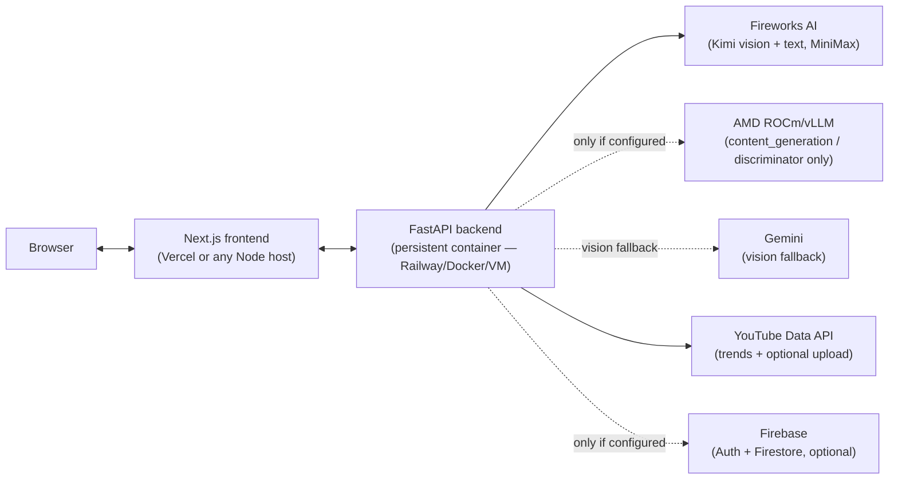
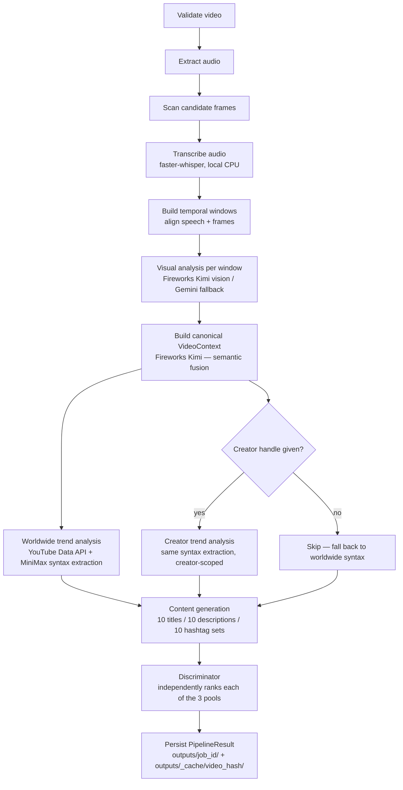
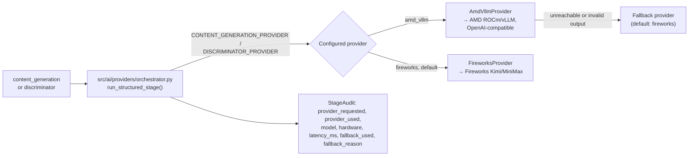
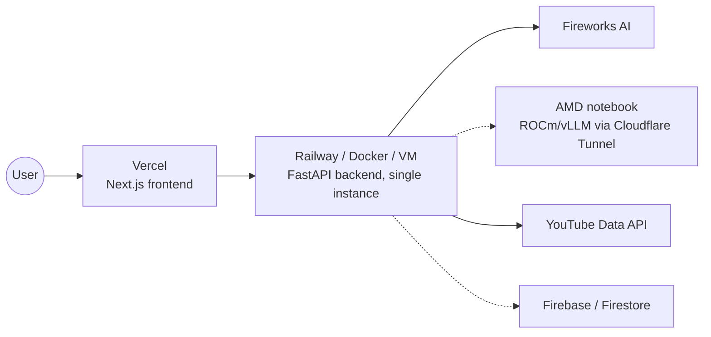

# Architecture

This is the single doc to read to understand ClipContext end to end in
under 10 minutes. Deeper detail lives in the linked docs — this page is
the map, not the territory.

## System overview

ClipContext is two deployable units talking over HTTP: a Next.js frontend
and a FastAPI backend that owns a video-processing pipeline. The backend
is the only thing that talks to any third-party AI/API service — the
browser never holds a Fireworks key, an AMD endpoint, or a YouTube OAuth
token.



Everything dotted is optional — ClipContext runs with just three required
backend keys (`FIREWORKS_API_KEY`, `YOUTUBE_API_KEY`, `GEMINI_API_KEY`) and
degrades cleanly: no AMD config → everything runs on Fireworks; no
Firebase config → no saved artifacts, everything else works; no YouTube
OAuth client → no "Connect with YouTube" upload, trend lookups (which use
a separate `YOUTUBE_API_KEY`, not OAuth) still work. See
[Environment.md](Environment.md) for the exact required/optional matrix.

## The video pipeline

One function, `run_pipeline()` in `src/pipeline/runner.py`, is the entire
product. Both the FastAPI job endpoint (`src/api/jobs.py`) and the
standalone CLI (`main.py`) call it — there is no duplicated business logic
between "the API" and "the CLI tool."



Full stage-by-stage detail, including real JSON shapes for each stage's
output: [AI-Pipeline.md](AI-Pipeline.md).

Two design points that shape a lot of the codebase:

- **Two-tier caching.** Transcription, visual timeline, and VideoContext
  are cached by a hash of the video's bytes — re-uploading the same video
  is free. Trends/syntax/generated content/rankings additionally depend on
  creator handle + platform, so they key on `job_id` (a hash of
  `video_hash + platform + creator_handle`).
- **Independent candidate pools.** Titles, descriptions, and hashtag sets
  are generated and ranked independently. Candidate id 3 in titles has no
  relationship to id 3 in descriptions — a user can freely mix and match.
- **Trend source is an override, not a blend.** Stage 8 (worldwide trend
  analysis) always runs. Stage 9 (creator trend analysis) only runs if
  `creator_handle` was given, and when it does, `run_pipeline()` uses the
  creator's syntax profile for content generation *instead of* the
  worldwide one — the two are never merged. The discriminator's ranking
  stage always benchmarks against the worldwide trend cluster regardless
  of which profile shaped generation. See [AI-Pipeline.md § Stage
  8-9](AI-Pipeline.md) for the exact fetch/cluster/extract mechanics.

## AI provider routing (the AMD integration point)

Two stages — **content generation** and the **discriminator** — are
text-only, structured-JSON calls, and are the only stages that can route
to an AMD GPU. Visual understanding always uses Fireworks Kimi (or the
Gemini fallback) because those stages take image input and the AMD
notebook serves a text-only model.



The audit record is truthful by construction: the frontend's AMD badge
(`AIUnderstandingCard.tsx`) reads `provider_used`, never
`provider_requested` — a stage that fell back to Fireworks never claims
AMD ran it. Full detail: [AMD.md](AMD.md) and [AI-Pipeline.md](AI-Pipeline.md).

## Two separate identity systems

This trips people up, so it gets a diagram. A ClipContext account
(optional, for saving results) and a connected YouTube channel (optional,
for uploading) are **never assumed to be the same identity**.

```mermaid
flowchart TD
    subgraph ClipContextAccount["ClipContext account (optional)"]
        direction LR
        A1["Firebase Auth\nGoogle sign-in, client-side"] --> A2["Firebase ID token"]
        A2 --> A3["Authorization: Bearer header"]
        A3 --> A4["src/firebase/auth.py verifies\nvia Firebase Admin SDK"]
        A4 --> A5["Firebase UID\n→ Firestore users/{uid}/artifacts"]
    end
    subgraph YouTubeConnect["Connect with YouTube (optional)"]
        direction LR
        B1["Google OAuth 2.0\nweb-server flow"] --> B2["cc_session HttpOnly cookie"]
        B2 --> B3["src/youtube/token_store.py\nserver-side, in-memory"]
        B3 --> B4["YouTube Data API\nchannel identity + uploads"]
    end
```



Logging out of ClipContext does not disconnect YouTube; disconnecting
YouTube does not log a user out of ClipContext. Detail:
[Firebase.md](Firebase.md), [YouTube.md](YouTube.md).

## Frontend state

Two React contexts hold everything the frontend needs across page
navigations, both persisted to `sessionStorage` so a full-page redirect
(e.g. returning from the Google OAuth consent screen) doesn't lose state:

- `VideoSessionContext` — current video/job/session, restored on mount via
  a `useEffect`. Pages gate their "no session, redirect home" logic on a
  `hydrated` flag so they don't redirect during the one render before
  restoration completes.
- `AuthContext` — Firebase login state.

Detail, including the full page/route map: [Frontend.md](Frontend.md).

## Non-negotiable invariants

These are safety/trust properties this codebase deliberately maintains.
They're easy to break by accident while "simplifying" a module, so any PR
touching one of these areas should call it out explicitly:

- **The browser never talks to the AMD vLLM endpoint directly.** Only the
  FastAPI backend does, via `AMD_VLLM_BASE_URL` in its own environment.
- **AMD usage is never faked.** `ai_audit` / `provider_used` on a
  `PipelineResult` reflects which provider *actually* handled that stage;
  the frontend's AMD badge (`AIUnderstandingCard.tsx`) only lights up when
  `provider_used === "amd_vllm"` for that specific stage, never on
  `provider_requested` alone. See [AMD.md](AMD.md).
- **ClipContext account login and "Connect with YouTube" are separate
  identity systems** (Firebase UID vs. a `cc_session` cookie tied to
  stored Google OAuth credentials) — never assume they're the same user.
  See [Firebase.md](Firebase.md) and [YouTube.md](YouTube.md).
- **`src/api/jobs.py`'s job registry, and the YouTube session/state/token
  stores in `src/youtube/`, are in-memory by design** — this is why
  `railway.toml` pins `numReplicas = 1`. Don't scale this backend
  horizontally without first adding shared state (Redis, a DB) for both.
- **The YouTube upload video path is always resolved server-side from
  `job_id`**, never accepted as a client-supplied path.
- Anonymous use must keep working with zero optional config: no
  `FIREBASE_PROJECT_ID`, no `GOOGLE_CLIENT_ID`, no AMD vars — upload,
  process, and results must all still work.

## Deployment topology



Why "single instance" is load-bearing, not a suggestion: the job registry
(`src/api/jobs.py`) and the YouTube session/token stores
(`src/youtube/`) are in-memory. Running more than one backend replica
splits that state across processes with no shared backing store, so job
polling and YouTube reconnects would randomly hit the wrong instance —
`railway.toml` pins `numReplicas = 1` for exactly this reason. Full
deployment guide, including the real memory-constraint tradeoff on small
hosting plans: [Deployment.md](Deployment.md).

## Repository structure

```
main.py                    Thin CLI wrapper over the pipeline service
requirements.txt           Backend Python dependencies
Dockerfile                 Backend container image
docker-compose.yml         Local dev: backend + frontend together
amd/                       AMD ROCm/vLLM inference service: start script,
                            diagnostics, smoke test, benchmark (amd/README.md)

src/
  api/                     FastAPI app, routes, job registry, API schemas
  pipeline/                Reusable pipeline service (paths, schemas, runner)
  video/                   Local video validation, audio/frame extraction
  ai/                      Transcription, temporal alignment, context
                            building, content generation, Fireworks client
  ai/providers/            AI provider abstraction (Fireworks / AMD vLLM,
                            registry, orchestrator with fallback + audit)
  models/                  Pydantic schemas (VideoContext, GeneratedContent,
                            discriminator ranking)
  trends/                  Worldwide + creator YouTube trend analysis
  youtube/                 YouTube OAuth + upload
  firebase/                Firebase Admin init, ID token verification
  artifacts/               Saved-artifact schemas + Firestore repository
  prompts/                 Content generation system prompt

frontend/
  app/                     Next.js App Router pages
  components/              UI components
  context/                 VideoSessionContext, AuthContext
  lib/                     Backend client, Firebase client init, polling hooks
  types/                   TypeScript types matching backend schemas

tests/                     pytest suite (all external calls mocked)
docs/                      This documentation set
data/, outputs/            Runtime artifacts (gitignored)
```

## Where to go next

| I want to... | Read |
|---|---|
| Understand every backend endpoint | [API.md](API.md) |
| Understand a pipeline stage in depth | [AI-Pipeline.md](AI-Pipeline.md) |
| Understand the frontend | [Frontend.md](Frontend.md) |
| Set up the AMD GPU path | [AMD.md](AMD.md) |
| Deploy to production | [Deployment.md](Deployment.md) |
| Configure every env var | [Environment.md](Environment.md) |
| Set up Firebase / accounts | [Firebase.md](Firebase.md) |
| Set up YouTube OAuth | [YouTube.md](YouTube.md) |
| Fix something that's broken | [Troubleshooting.md](Troubleshooting.md) |
| Start developing | [DeveloperGuide.md](DeveloperGuide.md) |
