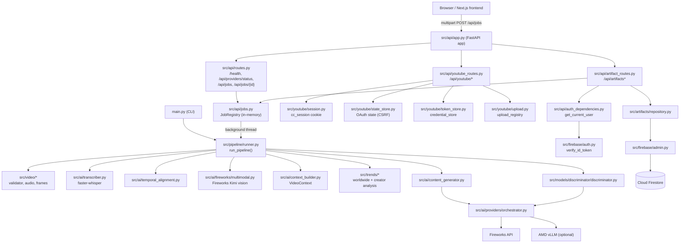
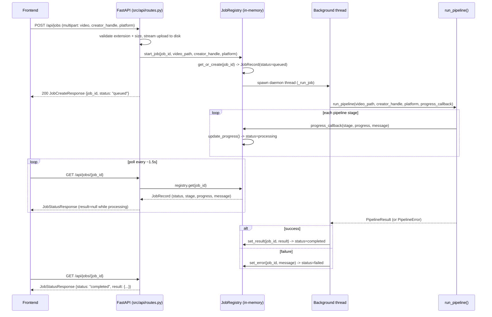

# Backend

The ClipContext backend is a Python 3.13 FastAPI application (`src/api/`)
sitting on top of a single reusable pipeline service (`src/pipeline/runner.py`).
It has no database — job state, YouTube OAuth sessions, and upload progress
all live in per-process memory, with pipeline *outputs* persisted to disk.
Saved user artifacts (title/description/hashtag selections) are the one
piece of durable state, and only when Firebase is configured.

This document covers backend architecture and runtime behavior. For the
full HTTP contract see [API.md](API.md); for what `run_pipeline()` actually
does stage by stage see [AI-Pipeline.md](AI-Pipeline.md); for the frontend
that talks to this backend see [Frontend.md](Frontend.md); for how any of
this gets deployed see [Deployment.md](Deployment.md).

## Two ways to run the pipeline

`src/pipeline/runner.py` exports one function, `run_pipeline()`, and both
entry points below call it — there is exactly one implementation of the
business logic.

### 1. API server (the normal path)

```bash
make backend
# .venv/bin/uvicorn src.api.app:app --reload --host 0.0.0.0 --port 8000
```

`src/api/app.py` builds the FastAPI app via `create_app()`:

```python
def create_app() -> FastAPI:
    validate_environment()
    app = FastAPI(title="ClipContext API")
    app.add_middleware(CORSMiddleware, allow_origins=get_allowed_origins(), ...)
    app.include_router(router)          # src/api/routes.py
    app.include_router(youtube_router)  # src/api/youtube_routes.py
    app.include_router(artifact_router) # src/api/artifact_routes.py
    return app
```

`validate_environment()` (`src/config.py`) checks `FIREWORKS_API_KEY`,
`YOUTUBE_API_KEY`, and `GEMINI_API_KEY` are set and raises `RuntimeError` at
import time if any are missing — the process refuses to start rather than
fail requests later. Firebase and YouTube OAuth (Google client
id/secret/redirect) are deliberately **not** in this required list; those
features degrade to structured "not configured" errors per-request instead
of blocking startup (see [API.md](API.md) for the `FIREBASE_NOT_CONFIGURED`
/ `YOUTUBE_OAUTH_NOT_CONFIGURED` error bodies).

`POST /api/jobs` stores the uploaded video to disk and starts the pipeline
on a background `threading.Thread`; the request returns immediately with a
`job_id`, and the frontend polls `GET /api/jobs/{job_id}` for progress.

### 2. Standalone CLI

```bash
.venv/bin/python main.py path/to/video.mp4 --creator @somecreator --platform youtube
```

`main.py` is a thin `argparse` wrapper: it calls `validate_environment()`,
then `run_pipeline()` synchronously with a `print_progress` callback that
writes `[ 55%] visual_analysis: ...` lines to stdout, then dumps
`result.video_context` as JSON. No FastAPI process, no job registry, no
HTTP involved — useful for local debugging or batch-processing a video
outside the API. `--creator` is optional (creator trend analysis is skipped
if omitted); `--platform` is `youtube` or `web`.

## Module / request flow



## In-memory job registry — and why it caps deployment at one replica

`src/api/jobs.py` defines `JobRegistry`, a plain `dict[str, JobRecord]`
guarded by a `threading.Lock`, module-scoped as `registry = JobRegistry()`.
Its own docstring states the tradeoff directly:

> Limitation (documented, acceptable for hackathon scope): job state lives
> in process memory only and is lost on backend restart. Final pipeline
> artifacts are still persisted to disk under `outputs/<job_id>/`, so a
> restart loses only the *tracking* of in-flight jobs, not completed
> results on disk.

`POST /api/jobs` calls `start_job()`, which does `registry.get_or_create(job_id)`
and, if the record is new, spawns a daemon `threading.Thread` running
`_run_job()` → `run_pipeline()`. Progress updates flow back through a
`progress_callback(stage, progress, message)` that the pipeline invokes
after every stage; `JobRegistry.update_progress()` writes it into the
`JobRecord` under its own per-record lock. `GET /api/jobs/{job_id}` just
reads the current `JobRecord` — there is no queue, no external process, no
persistence layer between the HTTP request and this dict.

Because this dict lives in one process's memory, `railway.toml` pins the
deployment to a single replica, with the reasoning spelled out inline:

```toml
[deploy]
# The job registry (src/api/jobs.py) and YouTube session/token stores are
# in-memory — see README.md "Known limitations". Running more than one
# replica would split job/session state across processes with no shared
# backing store, so job polling and YouTube reconnects would randomly hit
# the wrong instance. Keep this at 1 unless shared state is implemented.
numReplicas = 1
```

The same in-memory pattern, with the same single-replica constraint,
applies to `src/youtube/token_store.py` (`YouTubeCredentialStore`),
`src/youtube/state_store.py` (`OAuthStateStore`), and
`src/youtube/upload.py` (`YouTubeUploadRegistry`) — all four are
module-level, lock-guarded dicts with no shared backing store. Scaling this
backend horizontally would require moving all four to something like Redis
or Postgres first; see [Deployment.md](Deployment.md) for the current
single-instance deployment model.

## Job polling

There is no WebSocket or SSE channel — the frontend polls
`GET /api/jobs/{job_id}` on an interval (roughly every 1.5s per the
frontend implementation) until `status` becomes `"completed"` or `"failed"`.
Each poll returns the full current `JobStatusResponse`, including the
`PipelineStage` the pipeline is currently on and a 0-100 `progress` value
from the static `STAGE_PROGRESS` map in `src/pipeline/schemas.py`. Once
`status == "completed"`, the same response's `result` field carries the
full `PipelineResult` (video context, generated content, rankings, AI
audit) — there is no separate "fetch results" endpoint; the last job-status
poll *is* the results fetch. See the sequence diagram below and the full
field reference in [API.md](API.md).



## YouTube OAuth: session, state, and token stores

`src/api/youtube_routes.py` implements a "Connect with YouTube" flow that
is entirely independent from ClipContext account login (Firebase). It is
built on three small in-memory modules under `src/youtube/`:

- **`session.py`** — an opaque, unguessable per-browser session id.
  ClipContext has no user-account system for this feature, so a
  server-generated `secrets.token_urlsafe(32)` value stored in an
  `HttpOnly` cookie (`cc_session`, set by `set_session_cookie()`) is the
  minimum viable way to bind "this browser" to "these YouTube credentials"
  without one shared token for every visitor. `SameSite=None` cookies force
  `Secure=True` regardless of `COOKIE_SECURE`, since browsers reject that
  combination otherwise.
- **`state_store.py`** — `OAuthStateStore`, a single-use, TTL-expiring
  (`OAUTH_STATE_TTL_SECONDS`, 10 minutes) map from OAuth `state` to
  `(session_id, PKCE code_verifier)`. `create()` is called when the user
  clicks "Connect"; `consume()` is called on the OAuth callback and pops
  the entry, so a replayed callback URL fails the second time. `consume()`
  also verifies (via `secrets.compare_digest`) that the state was issued
  for *this* session, rejecting cross-session replay.
- **`token_store.py`** — `YouTubeCredentialStore`, keyed by `session_id`,
  storing only the fields needed to reconstruct a
  `google.oauth2.credentials.Credentials` object (`access_token`,
  `refresh_token`, `token_uri`, `scopes`, `expiry`, plus cached channel
  info). The raw `Credentials` object and the tokens themselves are never
  sent back to the browser.

The scopes requested are deliberately narrow: `youtube.upload` plus
`youtube.readonly` (needed because `youtube.upload` alone is rejected by
`channels.list(mine=true)` with a 403 `insufficientPermissions`, per a
comment in `src/config.py` noting this was verified against the live API)
— well short of the broad `youtube` (manage account) scope.

`GET /api/youtube/connect` returns a 302 to Google's consent screen (and
sets the session cookie if one doesn't exist yet); `GET /api/youtube/callback`
is where Google redirects back to, exchanges the authorization code,
fetches channel info, and stores credentials — it never raises an
`HTTPException` itself, instead always redirecting to the frontend's
`/results` page with either `?youtube=connected` or `?youtube=error&code=...`.
Uploading (`POST /api/jobs/{job_id}/youtube/upload`) runs on its own
background thread via `src/youtube/upload.py`'s `YouTubeUploadRegistry`,
which mirrors `JobRegistry`'s in-memory, lock-guarded pattern exactly (and
carries the same restart-loses-tracking caveat).

## Firebase: ClipContext accounts and artifact storage

Firebase is a second, unrelated identity system used only for the
"save this result to your account" feature (`src/api/artifact_routes.py`).
It is optional at startup:

- **`src/firebase/admin.py`** lazily and idempotently initializes the
  Firebase Admin SDK on first use (not at import time), so anonymous
  ClipContext usage (upload/process/results/YouTube connect) keeps working
  with zero Firebase configuration. Credential resolution order:
  `FIREBASE_SERVICE_ACCOUNT_JSON` (inline JSON, for PaaS hosts) →
  `GOOGLE_APPLICATION_CREDENTIALS` (path to a service-account file) →
  Application Default Credentials (for GCP-hosted deployments).
  `is_firebase_configured()` is checked by every artifact route; if false,
  the route returns `503 FIREBASE_NOT_CONFIGURED` instead of crashing.
- **`src/firebase/auth.py`** verifies a Firebase ID token via the Admin SDK
  (`verify_id_token()`) and returns an `AuthenticatedUser(uid, email,
  display_name, photo_url)`. The backend never trusts a uid/email sent
  directly by the client — only a cryptographically verified token.
- **`src/firebase/users.py`** best-effort upserts a `users/{uid}` profile
  document as a side effect of successful authentication; a Firestore
  hiccup here never fails the underlying request.
- **`src/api/auth_dependencies.py`** wraps this into two FastAPI
  dependencies: `get_current_user` (401 if no/invalid Bearer token) and
  `get_optional_current_user` (returns `None` instead of raising).
- **`src/artifacts/repository.py`** (`ArtifactRepository`) is the only code
  that touches Firestore for this feature, scoping every read/write to
  `users/{uid}/artifacts/...` derived from the verified uid — never from a
  client-supplied id. The AI pipeline itself (`src/pipeline/`) has zero
  Firestore dependency; persistence is purely an API-layer concern.

A saved artifact snapshots a completed job's `PipelineResult` (video
context, generated content, rankings) plus the user's title/description/
hashtag selection and, if the job was ever uploaded to YouTube via the
session-cookie flow above, a token-free summary of that upload. Because
`POST /api/artifacts` reads the source job from the in-memory `JobRegistry`,
saving fails with `409 JOB_INCOMPLETE` if the backend restarted between job
completion and the save click — already-saved artifacts are unaffected
since they live in Firestore, not the job registry.

## See also

- [API.md](API.md) — full endpoint reference, request/response shapes, error codes.
- [AI-Pipeline.md](AI-Pipeline.md) — every pipeline stage in execution order.
- [Frontend.md](Frontend.md) — the Next.js app that drives this backend.
- [Deployment.md](Deployment.md) — how this is actually hosted (Railway, single replica).
- [AMD.md](AMD.md) — the AMD ROCm/vLLM hackathon integration in detail.
