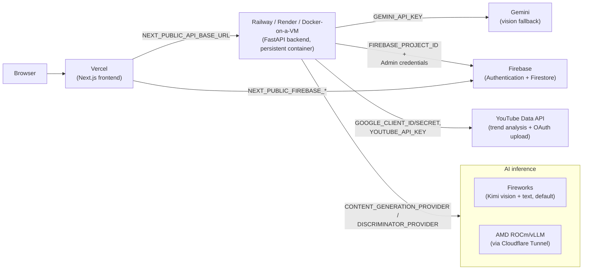

# Deployment

ClipContext is two independently deployable pieces: a Next.js frontend and a
FastAPI backend. This guide covers both, plus the AI inference targets
(Fireworks, AMD vLLM) and the two supporting services (Firebase, YouTube
Data API) they talk to. For everything AMD-specific, see
[AMD.md](AMD.md). For the full environment-variable reference, see
[Environment.md](Environment.md).

## Topology



The frontend never talks to Fireworks, AMD, Gemini, or the YouTube Data API
directly — only the backend does, using server-side keys. The frontend only
talks to the ClipContext backend and, for account login, directly to
Firebase Authentication using the public web config.

## Frontend (Vercel)

The repo is a monorepo: the Next.js app lives in `frontend/`, not the repo
root. In the Vercel project's **Settings → General → Root Directory**, set
it to `frontend`. Without this, Vercel will try to build from the repo root
and fail (there's no `package.json` there for a Next.js app — the root
`package.json` and `vercel.json` belong to the backend/repo tooling, not
the frontend build).

Build command (from `frontend/package.json`, Vercel's Next.js preset picks
this up automatically once Root Directory is set correctly):

```bash
npm run build   # → next build
```

Required environment variables, set in the Vercel project's environment
variable manager (not committed — see `frontend/.env.local.example`):

| Variable | Required | Purpose |
|---|---|---|
| `NEXT_PUBLIC_API_BASE_URL` | Yes | URL of the deployed backend, e.g. `https://your-backend.up.railway.app`. |
| `NEXT_PUBLIC_FIREBASE_API_KEY` | Only for ClipContext account login | Firebase web config. |
| `NEXT_PUBLIC_FIREBASE_AUTH_DOMAIN` | Only for ClipContext account login | Firebase web config. |
| `NEXT_PUBLIC_FIREBASE_PROJECT_ID` | Only for ClipContext account login | Firebase web config. |
| `NEXT_PUBLIC_FIREBASE_STORAGE_BUCKET` | Only for ClipContext account login | Firebase web config. |
| `NEXT_PUBLIC_FIREBASE_MESSAGING_SENDER_ID` | Only for ClipContext account login | Firebase web config. |
| `NEXT_PUBLIC_FIREBASE_APP_ID` | Only for ClipContext account login | Firebase web config. |

Leaving all six `NEXT_PUBLIC_FIREBASE_*` variables unset is a supported
configuration — the core workflow (upload, process, results, YouTube
upload) works without ClipContext accounts. See
[Environment.md](Environment.md) for the full variable list.

**Important gotcha: `NEXT_PUBLIC_*` variables are baked in at build time.**
Next.js inlines every `NEXT_PUBLIC_*` value into the JavaScript bundle
during `next build` — it does not read them from the runtime environment on
each request. Changing a `NEXT_PUBLIC_*` variable in Vercel's dashboard has
**no effect on an already-deployed build**; it only takes effect on the
*next* deployment. If you update `NEXT_PUBLIC_API_BASE_URL` or any Firebase
variable in Vercel, you must trigger a redeploy (a new commit, or
Vercel's "Redeploy" action) for the change to actually reach users.

Also set the backend's `ALLOWED_ORIGINS` to include the deployed frontend's
Vercel origin (see [Environment.md](Environment.md)), or the browser will
be blocked by CORS when calling the backend.

## Backend (Railway / persistent container)

The backend **must** run on a persistent container host, not short-lived
serverless functions. Per the comment at the top of the
[`Dockerfile`](../Dockerfile):

> Requires a persistent container host (not a short-lived serverless
> function): the pipeline shells out to ffmpeg, writes job artifacts to
> local disk, and runs long background jobs in-process.

The repo ships a [`Dockerfile`](../Dockerfile) (Python 3.13-slim, installs
`ffmpeg` via apt, installs `requirements.txt`, copies `main.py` and `src/`,
pre-creates the runtime data/output directories, and runs
`uvicorn src.api.app:app` honoring `$PORT` if the host injects one) and a
[`railway.toml`](../railway.toml) that points Railway at that Dockerfile.

```bash
docker build -t clipcontext-backend .
docker run -p 8000:8000 --env-file .env clipcontext-backend
```

### `numReplicas = 1` is required, not optional

`railway.toml` pins `numReplicas = 1`, and this is a hard requirement of
the current code, not a cost-saving default:

```toml
[deploy]
numReplicas = 1
```

Two pieces of backend state are process-local, in-memory Python
dictionaries with no shared backing store:

- **The job registry** (`src/api/jobs.py`, `JobRegistry`) — tracks every
  in-flight and completed job's status, stage, and progress, keyed by
  `job_id`, entirely in a `dict` guarded by a `threading.Lock`.
- **The YouTube OAuth session/token/state stores** (`src/youtube/session.py`,
  `src/youtube/token_store.py`, `src/youtube/state_store.py`) — the
  "Connect with YouTube" flow's session cookie binding, stored credentials,
  and CSRF state are all in-memory dicts keyed by an opaque session id.

If Railway ran more than one replica, requests would be load-balanced
across processes that don't share these dictionaries. A client polling
`GET /api/jobs/{id}` could hit a different replica than the one that
started the job and get a 404 as if the job never existed. A browser
completing the YouTube OAuth callback could land on a replica that never
saw the original `state` value or session, breaking the reconnect. This
isn't a theoretical edge case — with more than one replica it happens
routinely, since there's no session affinity guaranteed. Keep
`numReplicas = 1` unless and until shared state (e.g. Redis-backed job
registry and token store) is implemented.

### The real memory constraint

This is a known, documented limitation — not a resolved one. State it
plainly: Railway's free/starter tier commonly provisions around **1GB of
RAM** per service. This backend's dependency footprint is heavy, and nearly
all of it is imported at FastAPI boot (`src/api/app.py` imports
`src/api/routes.py`, `src/api/artifact_routes.py`, and
`src/api/youtube_routes.py`, which transitively pull in the full pipeline):

- `opencv-python` (video frame extraction)
- `pandas` + `scikit-learn` (trend analysis)
- `faster-whisper` / `ctranslate2` (local audio transcription)
- `google-api-python-client`, `google-auth`, `google-auth-oauthlib` (YouTube)
- `firebase-admin` (Firestore/Authentication)

Loading all of this at process start, and then running `faster-whisper`
transcription on a real video, can push resident memory past a 1GB ceiling.
When that happens, the Linux OOM killer sends a SIGKILL to the process —
the container just stops, and the Railway logs show a bare **"Killed"**
with no Python traceback, no stack trace, nothing to grep for. If you see
that, it is almost certainly the OOM killer, not an application bug.

Two real mitigations already exist in the code:

1. **`WHISPER_MODEL_SIZE`** — controls which faster-whisper model
   `src/ai/transcriber.py` loads. The code's actual default (`DEFAULT_WHISPER_MODEL_SIZE`
   in `src/ai/transcriber.py`) is `"tiny"` (~39M params), the smallest
   available faster-whisper model — chosen specifically because `"small"`
   (~244M params) was observed to OOM-kill a memory-constrained Railway
   deployment outright, and even `"base"` (~74M params) reduced but did not
   eliminate intermittent OOM kills. In other words: on a 1GB plan, even the
   smallest reasonable transcription model is a mitigation, not a
   guarantee. Raise `WHISPER_MODEL_SIZE` to `base`/`small`/`medium` only on
   a host with meaningfully more memory headroom, where transcript accuracy
   matters more than staying under a tight limit.
2. **Run the backend locally for demo purposes.** `make backend` runs the
   same FastAPI app with `uvicorn --reload` against your laptop's own RAM,
   which is not the constraint a 1GB cloud plan is. For a hackathon demo or
   local development, this sidesteps the memory ceiling entirely.

The real fix for production use is to **upgrade the Railway plan's memory
allocation** so the process has real headroom above its boot-time import
cost plus a real transcription job's peak usage. Alternatives to Railway
that are equally viable, since the only hard requirement is a persistent
container (not a specific vendor): **Render** (persistent web service, same
Dockerfile) and **plain Docker on a VM** (any host that can run
`docker run` and keep the container alive — a small VPS, an EC2/GCE
instance, etc.). Whichever host you choose, it must give the container
enough memory to survive its own boot-time imports plus a real
transcription job; sizing that correctly is the actual fix, not a
workaround.

### Backend environment and health check

`railway.toml` also configures:

```toml
healthcheckPath = "/health"
healthcheckTimeout = 100
restartPolicyType = "ON_FAILURE"
restartPolicyMaxRetries = 3
```

`GET /health` returns a simple `{"status": "ok"}` with no live dependency
checks — it's meant for fast liveness polling, not diagnosing provider
reachability. Use `GET /api/providers/status` (see [AMD.md](AMD.md)) to
check whether Fireworks/AMD vLLM are actually reachable.

Set the backend's required and optional environment variables per
[Environment.md](Environment.md). At minimum, `FIREWORKS_API_KEY`,
`YOUTUBE_API_KEY`, and `GEMINI_API_KEY` must be set or the process refuses
to start (`src/config.py`'s `validate_environment()` raises at import time).

## Docker (general)

`.dockerignore` excludes `.venv/`, `data/`, `outputs/`, `tests/`,
`frontend/`, and local dotfiles/docs from the build context, so the image
only contains what `main.py` / `src/` actually need at runtime plus
`requirements.txt`. No secrets are baked into the image — everything is
passed at runtime via environment variables (`--env-file .env` for local
`docker run`, or the host's environment-variable manager in production).

The image exposes port 8000 and honors `$PORT` if the host injects one
(Cloud Run, Railway, Fly.io, etc.), defaulting to 8000 for a plain
`docker run`. In production, the backend and frontend are deployed as two
separate services on two separate hosts (Vercel + Railway/Render/a VM) —
`docker-compose.yml` at the repo root is for **local development only**
(`docker compose up --build` runs both with hot-reload; see
[DeveloperGuide.md](DeveloperGuide.md)), not a production orchestration
setup.

## YouTube OAuth in production

If the frontend and backend are on different origins (the normal case:
Vercel + Railway), the YouTube OAuth session cookie needs cross-site cookie
settings:

```
COOKIE_SECURE=true
COOKIE_SAMESITE=none
```

`SameSite=None` is rejected by browsers unless `Secure` is also set. You'll
also need, in the backend's production environment:

```
GOOGLE_CLIENT_ID=...
GOOGLE_CLIENT_SECRET=...
GOOGLE_OAUTH_REDIRECT_URI=https://<your-backend-host>/api/youtube/callback
FRONTEND_URL=https://<your-frontend-host>
ALLOWED_ORIGINS=https://<your-frontend-host>
```

Register the production `GOOGLE_OAUTH_REDIRECT_URI` as a second
"Authorized redirect URI" on the same OAuth client in Google Cloud Console
(keep the localhost one for continued local development). See
[Environment.md](Environment.md) for the full variable reference.

## Firebase (ClipContext accounts) in production

1. In Firebase Console → **Authentication → Settings → Authorized
   domains**, add the deployed frontend's domain (e.g.
   `your-app.vercel.app`) — `localhost` is authorized by default,
   production domains are not added automatically.
2. Set the six `NEXT_PUBLIC_FIREBASE_*` values in Vercel's environment
   variable manager (remember: this requires a redeploy to take effect, per
   the gotcha above).
3. On the backend host, set `FIREBASE_PROJECT_ID` and provide Admin
   credentials: `FIREBASE_SERVICE_ACCOUNT_JSON` (inline JSON — the only
   option on hosts like Railway/Render that don't support mounted files) or
   `GOOGLE_APPLICATION_CREDENTIALS` (a file path — only useful if the
   backend runs somewhere that supports file mounts). If the backend runs
   on Cloud Run/GCE/GKE with an attached service account, both can be left
   unset and Application Default Credentials are used automatically.

## AMD vLLM in production

Only relevant if `CONTENT_GENERATION_PROVIDER` or `DISCRIMINATOR_PROVIDER`
is set to `amd_vllm` on the backend. See [AMD.md](AMD.md) for the full
integration writeup and [`amd/README.md`](../amd/README.md) for the
notebook-side setup. In short: `AMD_VLLM_BASE_URL`, `AMD_VLLM_MODEL`, and
`AMD_VLLM_API_KEY` are set only in the backend's own environment (Railway),
never in the frontend, and the AMD notebook's Cloudflare Tunnel URL is
ephemeral — it must be refreshed and re-verified (`GET /api/providers/status`)
before each demo, not assumed to still be live from an earlier session.

## Related documentation

- [Environment.md](Environment.md) — every environment variable, in full.
- [AMD.md](AMD.md) — AMD GPU integration deep-dive.
