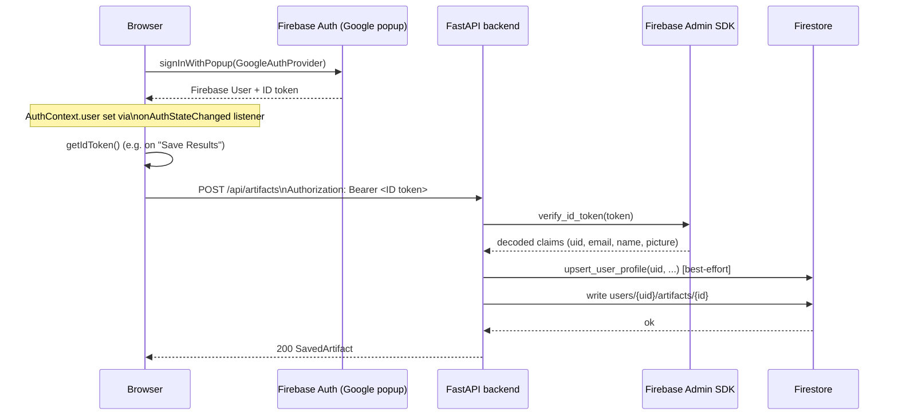

# Firebase (ClipContext accounts)

ClipContext uses Firebase for exactly one feature: optional user accounts
that let someone save a generation's titles/descriptions/hashtags/AI
analysis ("artifacts") and revisit them later. Firebase is **not** involved
in the YouTube upload feature — connecting a YouTube channel and uploading a
video to it is a completely separate Google OAuth 2.0 flow with its own
credentials and its own identity. See [YouTube.md](YouTube.md) for that
system, and the comparison table below for how the two are kept apart in
code.

Two Firebase products are used:

- **Firebase Authentication**, Google provider only — identifies a
  ClipContext account.
- **Cloud Firestore** — stores each account's saved artifacts at
  `users/{uid}/artifacts/{artifact_id}`.

## ClipContext accounts vs. YouTube connection

| | ClipContext account login | Connect with YouTube |
|---|---|---|
| Purpose | Identifies *you* to save/retrieve artifacts | Authorizes ClipContext to upload videos to *a* channel |
| Technology | Firebase Authentication (Google provider) | Raw Google OAuth 2.0 web-server flow |
| Identity | Firebase UID | YouTube channel, via an opaque `cc_session` cookie |
| Where it's checked | `Authorization: Bearer <Firebase ID token>` header | `cc_session` HttpOnly cookie |
| Frontend module | `frontend/context/AuthContext.tsx`, `frontend/lib/firebase.ts` | `frontend/components/YouTubeUploadPanel.tsx`, `frontend/lib/useYouTubeUploadPolling.ts` |
| Backend module | `src/firebase/`, `src/api/auth_dependencies.py`, `src/api/artifact_routes.py` | `src/youtube/`, `src/api/youtube_routes.py` |

A user can be signed into ClipContext with Google account A and have
connected a YouTube channel authorized through Google account B — nothing in
this codebase assumes those are the same identity. `frontend/context/
AuthContext.tsx` and `src/api/artifact_routes.py` both say so explicitly in
their module comments. Logging out of ClipContext does not disconnect
YouTube, and disconnecting YouTube does not log the user out of ClipContext.

## Backend: Firebase Admin SDK (`src/firebase/admin.py`)

Initialization is lazy and idempotent — `firebase_admin.initialize_app()` is
called at most once, on first use, not at import time or process startup.
This is what makes the rest of the pipeline (upload, processing, results,
YouTube upload) work with zero Firebase configuration: nothing calls
`get_firebase_app()` unless a request actually hits an artifact/account
endpoint.

`get_firebase_app()` first checks `FIREBASE_PROJECT_ID`; if unset, it logs
"Firebase Admin not configured" and returns `None` without raising. If set,
it resolves credentials in this order (first match wins), per
`_build_credentials()`:

1. **`FIREBASE_SERVICE_ACCOUNT_JSON`** — the service-account JSON pasted
   inline as an environment variable (`credentials.Certificate(json.loads(...))`).
   Useful on hosts that only support environment variables, not file mounts.
2. **`GOOGLE_APPLICATION_CREDENTIALS`** — a filesystem path to a
   service-account JSON file (`credentials.Certificate(path)`). Must never be
   committed to the repo.
3. **Application Default Credentials** (`credentials.ApplicationDefault()`) —
   used automatically when neither of the above is set and the backend
   itself runs on Google Cloud (Cloud Run, GCE, GKE) with an attached
   service account. No explicit credential needed there.

Use exactly one of options 1 or 2 — never both. `is_firebase_configured()`
is just `get_firebase_app() is not None`, and `reset_for_tests()` exists
solely so the test suite can clear the cached app between test cases.

## Backend: verifying identity (`src/firebase/auth.py`, `src/api/auth_dependencies.py`)

`src/firebase/auth.py`'s `verify_id_token()` never trusts a uid, email, or
display name sent directly by the browser. The only identity the backend
accepts is one cryptographically verified from a Firebase ID token via
`firebase_admin.auth.verify_id_token()`. `src/api/auth_dependencies.py`
extracts the token from `Authorization: Bearer <token>`, exposes two FastAPI
dependencies:

- `get_current_user` — raises `401` if the header is missing or the token is
  invalid/expired; on success, also calls `upsert_user_profile()`
  (`src/firebase/users.py`) to write/update `users/{uid}` in Firestore
  (`display_name`, `email`, `photo_url`, `last_login_at`, `created_at` on
  first login). That profile write is best-effort — a Firestore hiccup there
  never fails the authenticated request itself.
- `get_optional_current_user` — returns `None` instead of raising when no
  valid token is present; unused by the current artifact routes (which all
  require auth), but available for future optional-auth endpoints.

## Backend: Firestore artifacts (`src/artifacts/repository.py`, `src/api/artifact_routes.py`)

`ArtifactRepository` centralizes every Firestore read/write for this
feature. Every method takes a verified `uid` and scopes all access to
`users/{uid}/artifacts/...` — the Firestore path is derived from the
authenticated uid, never from anything the client supplies, so there is no
code path that can read or write another user's documents.

- `POST /api/artifacts` (`create_artifact`) — takes `{ job_id,
  selected_title_id, selected_description_id, selected_hashtag_set_id,
  video_display_name? }`. It re-reads the actual `PipelineResult` from the
  in-memory job registry (not from the request body) and validates the
  selected candidate ids are real before saving — the browser cannot
  fabricate arbitrary generated content. Saving the same `job_id` twice
  updates the existing artifact (`upsert_by_source_job`) instead of creating
  a duplicate. It also embeds safe (tokenless) YouTube upload metadata if
  that job was already uploaded in the same browser session, looked up via
  the `cc_session` cookie — entirely independent of the Firebase-authenticated
  user, since the two are different identities (see the comparison table
  above).
- `GET /api/artifacts` (`list_artifacts`) — summary list, newest first.
- `GET /api/artifacts/{artifact_id}` (`get_artifact`) — full saved artifact;
  `404` if it doesn't exist or isn't the caller's.
- `DELETE /api/artifacts/{artifact_id}` (`delete_artifact`) — `204` on
  success, `404` otherwise.

Every one of these routes calls `_require_firebase()` first, which raises:

```python
raise HTTPException(
    status_code=503,
    detail={
        "code": "FIREBASE_NOT_CONFIGURED",
        "message": "Cloud save is not configured on this server yet.",
    },
)
```

That is a structured, predictable `503` — not a crash — whenever
`FIREBASE_PROJECT_ID` is unset. `src/artifacts/schemas.py` defines the
Pydantic models used by these routes (`ArtifactCreateRequest`,
`SavedArtifact`, `ArtifactSummary`, etc.), matching the frontend's
`frontend/types/artifact.ts` field-for-field.

## Anonymous-use guarantee

The rest of ClipContext has zero dependency on Firebase being configured:

- Video upload (`POST /api/jobs`), job polling, results, and the entire
  YouTube connect/upload flow (`src/youtube/`, `src/api/youtube_routes.py`)
  never import or call anything in `src/firebase/`.
- `get_firebase_app()`'s lazy, guarded initialization means an unconfigured
  Firebase project never raises during app startup or during any
  non-artifact request — the process boots and serves everything else
  normally.
- The only user-visible effect of missing Firebase config is that
  `/api/artifacts/*` returns the `FIREBASE_NOT_CONFIGURED` `503` above, and
  the frontend's `AuthPromptModal` shows "Sign-in isn't configured on this
  server yet." (driven by `AuthContext.firebaseConfigured`, itself derived
  from `frontend/lib/firebase.ts`'s `isFirebaseConfigured()` — see below).

In short: accounts are additive, not load-bearing. A contributor can clone
the repo, set only the AI-provider and video-pipeline env vars, and get a
fully working upload → process → results → YouTube-upload experience with
`FIREBASE_PROJECT_ID` left blank.

## Frontend: public web config (`frontend/lib/firebase.ts`)

`frontend/lib/firebase.ts` is the only place `initializeApp()`/`getAuth()`
are called; every other module imports `getFirebaseAuth()` /
`isFirebaseConfigured()` from it instead of touching the Firebase SDK
directly. The config object reads six `NEXT_PUBLIC_FIREBASE_*` variables:

```ts
const firebaseConfig = {
  apiKey: process.env.NEXT_PUBLIC_FIREBASE_API_KEY,
  authDomain: process.env.NEXT_PUBLIC_FIREBASE_AUTH_DOMAIN,
  projectId: process.env.NEXT_PUBLIC_FIREBASE_PROJECT_ID,
  storageBucket: process.env.NEXT_PUBLIC_FIREBASE_STORAGE_BUCKET,
  messagingSenderId: process.env.NEXT_PUBLIC_FIREBASE_MESSAGING_SENDER_ID,
  appId: process.env.NEXT_PUBLIC_FIREBASE_APP_ID,
};
```

`isFirebaseConfigured()` checks that `apiKey`, `projectId`, and `appId` are
all present; if not, `getFirebaseApp()`/`getFirebaseAuth()` return `null`
rather than throwing, and `AuthProvider` (`frontend/context/AuthContext.tsx`)
sets `loading = false` with no auth listener attached.

As the code comment in `lib/firebase.ts` states directly: **this config is
not a server secret**. It ships in any deployed JavaScript bundle by design
— Firebase's actual access control lives in Firebase Authentication (who can
sign in) and Firestore Security Rules (who can read/write which documents),
not in hiding these values. That's why they're plain `NEXT_PUBLIC_*`
variables (bundled into client JS at build time) rather than server-only
secrets — they're still environment-specific (dev/staging/prod use different
Firebase projects), just not confidential.

`.env.example` documents this distinction directly next to the Firebase
section: these six vars belong in `frontend/.env.local`, are separate from
`GOOGLE_CLIENT_ID`/`GOOGLE_CLIENT_SECRET` (the YouTube OAuth client secret,
which **is** a real server secret), and can be left unset entirely to run
without accounts.

### Firestore security rules

Because every artifact read/write goes through the authenticated FastAPI
backend (using the Admin SDK, which bypasses Firestore Security Rules by
design), the browser should never query Firestore directly. Set Firestore to
deny all direct client access in Firebase Console → **Firestore Database →
Rules**:

```
rules_version = '2';
service cloud.firestore {
  match /databases/{database}/documents {
    match /{document=**} {
      allow read, write: if false;
    }
  }
}
```

If Firebase Console created the database in "test mode" (which defaults to
`allow read, write: if true` for 30 days), replace it with the rules above —
test mode is not safe to leave in place.

## Sign-in sequence



Note that the frontend talks to Firebase Auth directly (client-side SDK) for
sign-in itself; the backend is only ever shown the resulting ID token, never
a password or OAuth code for this flow.

## Setting up your own Firebase project (from scratch)

These steps assume you have never used Firebase before and want ClipContext
accounts working locally.

1. Go to the [Firebase Console](https://console.firebase.google.com/) and
   click **Add project**. You can reuse the same underlying Google Cloud
   project you use for YouTube API access (see [YouTube.md](YouTube.md)) if
   you have one — one project, one billing account, simpler to reason about
   — or create a brand-new project. Name it anything (e.g. `clipcontext-dev`).
2. In the left sidebar, go to **Build → Authentication**, click **Get
   started**, open the **Sign-in method** tab, and enable **Google** as a
   provider. Set a support email when prompted, then save.
3. Go to **Build → Firestore Database**, click **Create database**, pick a
   location close to you, and start it in either mode — then immediately
   apply the "deny all direct client access" rules shown above under
   **Firestore Database → Rules**, since all real access goes through the
   backend.
4. Go to **Project settings** (the gear icon next to "Project Overview") →
   **General** tab → scroll to **Your apps** → click **Add app → Web**
   (the `</>` icon). Register it (the nickname doesn't matter; no Firebase
   Hosting setup needed). Firebase will show you a `firebaseConfig` object —
   copy each value into `frontend/.env.local`:
   ```
   NEXT_PUBLIC_FIREBASE_API_KEY=...
   NEXT_PUBLIC_FIREBASE_AUTH_DOMAIN=...
   NEXT_PUBLIC_FIREBASE_PROJECT_ID=...
   NEXT_PUBLIC_FIREBASE_STORAGE_BUCKET=...
   NEXT_PUBLIC_FIREBASE_MESSAGING_SENDER_ID=...
   NEXT_PUBLIC_FIREBASE_APP_ID=...
   ```
5. Still in **Project settings**, open the **Service accounts** tab and
   click **Generate new private key** — this downloads a JSON file. This is
   the Admin SDK credential for the backend. **Never commit this file.**
   Store it outside the repo (safest), or inside the repo root if you use a
   gitignored filename pattern like `firebase-service-account*.json` /
   `*firebase-adminsdk*.json` / `serviceAccountKey.json`. Then, in the
   backend's root `.env`:
   ```
   FIREBASE_PROJECT_ID=<the projectId from step 4>
   GOOGLE_APPLICATION_CREDENTIALS=/absolute/path/to/that-file.json
   ```
   If your host only supports environment variables (no file mounts), use
   `FIREBASE_SERVICE_ACCOUNT_JSON=<the entire JSON file's contents, inline>`
   instead of `GOOGLE_APPLICATION_CREDENTIALS` — set exactly one of the two.
6. Go to **Authentication → Settings → Authorized domains**. `localhost` is
   authorized by default, so local dev works immediately. Before testing
   Google sign-in against a deployed frontend, add that domain here (e.g.
   `your-app.vercel.app`) — Google sign-in fails with an
   `auth/unauthorized-domain` error from any origin not on this list.
7. Restart the backend (so it picks up `FIREBASE_PROJECT_ID` and the
   credential) and the frontend dev server (so it picks up the
   `NEXT_PUBLIC_FIREBASE_*` values baked in at build time). Click "Log In" in
   the app and confirm the Google popup completes and `/artifacts` loads.

## Environment variable reference

| Variable | Where | Required for accounts | Notes |
|---|---|---|---|
| `FIREBASE_PROJECT_ID` | root `.env` | Yes | Without it, `/api/artifacts/*` returns `FIREBASE_NOT_CONFIGURED` (503); everything else still works. |
| `GOOGLE_APPLICATION_CREDENTIALS` | root `.env` | One of these two | Path to the downloaded service-account JSON file. Gitignored, never commit. |
| `FIREBASE_SERVICE_ACCOUNT_JSON` | root `.env` | One of these two | The service-account JSON inline, for hosts without file-mount support. Use instead of, not alongside, `GOOGLE_APPLICATION_CREDENTIALS`. |
| `NEXT_PUBLIC_FIREBASE_API_KEY` | `frontend/.env.local` | Yes | Not a server secret — see above. |
| `NEXT_PUBLIC_FIREBASE_AUTH_DOMAIN` | `frontend/.env.local` | Yes | |
| `NEXT_PUBLIC_FIREBASE_PROJECT_ID` | `frontend/.env.local` | Yes | |
| `NEXT_PUBLIC_FIREBASE_STORAGE_BUCKET` | `frontend/.env.local` | Yes | |
| `NEXT_PUBLIC_FIREBASE_MESSAGING_SENDER_ID` | `frontend/.env.local` | Yes | |
| `NEXT_PUBLIC_FIREBASE_APP_ID` | `frontend/.env.local` | Yes | |

If neither Admin credential is set and the backend itself runs on Google
Cloud (Cloud Run, GCE, GKE) with an attached service account, Application
Default Credentials are used automatically — no explicit credential needed
there.

See also [Frontend.md](Frontend.md) for how `AuthContext` and
`VideoSessionContext` compose, and [Environment.md](Environment.md) for the
full environment variable list across the whole app.
