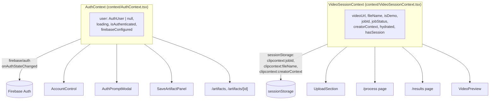

# Frontend

The ClipContext frontend is a Next.js 14 App Router application (`frontend/`)
that drives the upload → process → results flow, hosts the two identity
systems documented in [Firebase.md](Firebase.md) and [YouTube.md](YouTube.md),
and lets a signed-in user browse previously saved results. It talks to the
FastAPI backend described in [Backend.md](Backend.md) over plain `fetch`
calls (`frontend/lib/api.ts`) — there is no server-side rendering of backend
data; every data-bearing page is a client component (`"use client"`).

## Page / route structure

All routes live under `frontend/app/` using the App Router. There is no
route-group nesting or middleware — navigation between steps is driven by
`next/navigation`'s `useRouter` calls inside client components, not by
server redirects.

| Route | File | Purpose |
|---|---|---|
| `/` | `app/page.tsx` | Landing page: `Navbar`, `Hero`, `UploadSection` (the actual upload dropzone, anchored at `#upload`), `FeatureCards`, `TechnologyPipeline`, `Footer`. |
| `/process` | `app/process/page.tsx` | Polls job status via `useJobPolling` and shows `ProcessingPanel`'s staged progress UI. Redirects to `/results` the moment the job status becomes `"completed"`. |
| `/results` | `app/results/page.tsx` | Renders `ResultsPanel` with either the real `PipelineResult` (from job polling) or `DEMO_RESULT` (demo mode). Hosts `SaveArtifactPanel` and `YouTubeUploadPanel`. |
| `/artifacts` | `app/artifacts/page.tsx` | Lists the signed-in user's saved artifacts (`GET /api/artifacts`); prompts sign-in if not authenticated. |
| `/artifacts/[artifactId]` | `app/artifacts/[artifactId]/page.tsx` | Detail view of one saved artifact (`GET /api/artifacts/{id}`) — ranked candidate pools, `AIUnderstandingCard`, and past YouTube upload metadata if that job was ever published. |

`frontend/app/layout.tsx` is the root layout: it loads the `Inter` and
`JetBrains Mono` fonts, sets page `metadata`, and wraps `children` in
`<Providers>`. `frontend/app/providers.tsx` nests `AuthProvider` around
`VideoSessionProvider`, so both contexts are available on every route.

```mermaid
flowchart LR
    Root["/ (Landing)\napp/page.tsx"] -->|Upload video\ncreateJob()| Process["/process\napp/process/page.tsx"]
    Root -->|"Watch Demo"\nstartDemo()| Process
    Process -->|job status\n=== completed| Results["/results\napp/results/page.tsx"]
    Results -->|"Save Results"\n(auth required)| Artifacts["/artifacts\napp/artifacts/page.tsx"]
    Artifacts -->|open row| ArtifactDetail["/artifacts/[artifactId]\napp/artifacts/[artifactId]/page.tsx"]
    Results -.->|"Connect YouTube"\nfull-page redirect to Google,\nthen back to /results| Results
```

## State architecture: two React contexts

`frontend/context/VideoSessionContext.tsx` and
`frontend/context/AuthContext.tsx` are independent and know nothing about
each other. This mirrors the backend split between the YouTube session
cookie and Firebase ID tokens (see [YouTube.md](YouTube.md) and
[Firebase.md](Firebase.md)).



### `VideoSessionContext`

Holds the client's view of the in-progress (or demo) video job:

- `videoUrl` / `fileName` — an `URL.createObjectURL(file)` reference (revoked
  on change/unmount) and the original filename. `videoUrl` is `null` for a
  demo session or after a page refresh (the browser `File`/object URL cannot
  survive a reload).
- `isDemo` — set by `startDemo()` (the Hero "Watch Demo" button); routes the
  UI to `DEMO_RESULT` instead of a live backend job.
- `jobId` / `jobStatus` — set by `setJob()` after `POST /api/jobs` succeeds;
  `jobId` (but not the transient `jobStatus`) is persisted to
  `sessionStorage` under `clipcontext:jobId` so it survives a reload — the
  backend job registry, not the browser, remains the source of truth for the
  actual processing state.
- `creatorContext.youtubeChannelUrl` — the optional "Creator Context" URL
  entered on `/`, persisted to `sessionStorage` under
  `clipcontext:creatorContext`.
- `hasSession` — `hydrated && Boolean(videoUrl || isDemo || jobId)`; pages use
  this to decide whether to redirect back to `/#upload`.
- `hydrated` — see "The `hydrated` flag" below.

### `AuthContext`

Wraps Firebase's `onAuthStateChanged` listener into `user: AuthUser | null`,
plus `loginWithGoogle`/`logout`/`getIdToken`. `firebaseConfigured` reflects
`lib/firebase.ts`'s `isFirebaseConfigured()` check (all three of
`NEXT_PUBLIC_FIREBASE_API_KEY`/`PROJECT_ID`/`APP_ID` present) — when false,
`getFirebaseAuth()` returns `null` and every auth action becomes a no-op or a
friendly "Sign-in isn't configured on this server yet." message instead of
throwing. See [Firebase.md](Firebase.md) for the full anonymous-use
guarantee.

## The `hydrated` flag — why it exists

`VideoSessionProvider` restores `jobId`, `fileName`, and `creatorContext`
from `sessionStorage` inside a `useEffect`, which only runs after the first
client render. On that very first render, before the effect has run,
`jobId` is still `null` — so a naive check like `if (!hasSession) redirect()`
would fire on every mount, including ones where a valid session is about to
be restored a tick later.

This matters concretely for the "Connect with YouTube" flow
([YouTube.md](YouTube.md)): clicking "Connect YouTube" on `/results`
navigates the whole browser tab away to Google's consent screen and back,
which is a **full page reload** — it remounts the entire React tree,
including `VideoSessionProvider`, and re-triggers the restore-from-
`sessionStorage` effect from scratch. Without gating on `hydrated`, the
`/results` page's session-guard `useEffect` would see `hasSession === false`
on the pre-restore render and call `router.replace("/#upload")`, bouncing a
user who has a perfectly valid in-progress job back to the homepage — one
render tick before their `jobId` would have been restored.

The fix (already in place in both `app/process/page.tsx` and
`app/results/page.tsx`) is to gate the redirect on `hydrated`:

```tsx
useEffect(() => {
  if (hydrated && !hasSession) {
    router.replace("/#upload");
  }
}, [hydrated, hasSession, router]);

if (!hydrated || !hasSession) return null;
```

Both pages render `null` until `hydrated` is true, so nothing renders (and no
redirect fires) until the restore effect has had a chance to run.

## Job status polling

`frontend/lib/useJobPolling.ts` polls `GET /api/jobs/{jobId}` every 1500ms
(`POLL_INTERVAL_MS`) via `getJob()` in `lib/api.ts`. It:

- Stops polling once `status` is `"completed"` or `"failed"`.
- Uses an `AbortController` per poll and cleans it up on unmount or `jobId`
  change, so a stale response after navigating away is never applied.
- On a transient fetch error, keeps retrying on the same interval rather than
  giving up (network hiccups don't kill the polling loop); it does surface
  the error string via the returned `error` field.
- Is driven purely by `jobId` — pass `null` (as `/results` does when
  `isDemo` is true) to disable polling entirely.

`frontend/lib/useYouTubeUploadPolling.ts` is the same pattern applied to
`GET /api/youtube/uploads/{uploadId}` — see [YouTube.md](YouTube.md) for the
upload flow it drives. One behavioral difference: on a `YouTubeApiError` it
stops polling immediately (YouTube upload failures are terminal, not
transient), whereas `useJobPolling` keeps retrying on error.

## Demo mode

Demo mode exists so someone can click through the entire UI — landing page,
processing animation, results, candidate selection — without a running
backend. It is triggered by the Hero section's "Watch Demo" button
(`startDemo()` in `VideoSessionContext`), which sets `isDemo = true` and a
placeholder `fileName` ("product-demo.mp4") with `videoUrl = null`, then
navigates to `/process`.

- `app/process/page.tsx`: when `isDemo && !jobId`, it skips the staged
  progress animation and renders a static "Demo mode: showing sample output"
  `ProcessingPanel` at 100%, since there is no real job to poll.
- `app/results/page.tsx`: when `isDemo`, `useJobPolling` is called with `null`
  (no polling), and the rendered result is `DEMO_RESULT` from
  `frontend/lib/generatedContent.ts` instead of `jobStatus?.result`.
- `DEMO_RESULT` is a hand-written `PipelineResult` — 10 sample titles, 10
  descriptions, 10 hashtag sets, a synthetic `video_context`, and an empty
  `ai_audit: []` (demo mode never ran real inference, so no AMD/Fireworks
  indicator should render for it — see `AIUnderstandingCard.tsx`).
- Demo results cannot be saved as artifacts: `SaveArtifactPanel` disables
  saving when `isDemo` is true, and the YouTube upload panel is gated on
  `jobComplete = !isDemo`.

## Major components (`frontend/components/`)

| Component | Role |
|---|---|
| `ProcessingPanel.tsx` | Renders the pipeline's current stage (from `PIPELINE_STAGE_ORDER`/`PIPELINE_STAGE_LABELS` in `types/video.ts`) as an icon, progress bar, and stage-dot rail. |
| `ResultsPanel.tsx` | The main results UI: candidate pool tabs, editable title/description/hashtags, copy/export actions, and hosts `SaveArtifactPanel` + `YouTubeUploadPanel`. Persists the user's in-progress selection/edits to `sessionStorage` per job id so a YouTube-OAuth round trip doesn't reset them. |
| `CaptionTabs.tsx` | The Titles / Descriptions / Hashtags tab switcher, reused by `ResultsPanel`, `Hero`, and the artifact detail page. |
| `UploadSection.tsx` | The drag-and-drop video dropzone on `/`; validates file type/extension, optionally collects a YouTube channel URL for "Creator Context", and calls `createJob()` to start a pipeline run. |
| `YouTubeUploadPanel.tsx` | Shows YouTube connection status, a review-and-confirm upload form (privacy, made-for-kids), upload progress, and per-error-code messaging; also consumes the `?youtube=connected|error` query params left by the OAuth callback redirect. |
| `SaveArtifactPanel.tsx` | "Save Results" card; prompts sign-in via `AuthPromptModal` if needed, then calls `createArtifact()`. |
| `AccountControl.tsx` | Navbar auth widget — Log In / Get Started buttons when signed out, avatar + dropdown (My Artifacts, Log Out) when signed in. Reflects `AuthContext` only. |
| `AuthPromptModal.tsx` | Shared "Continue with Google" modal, portaled to `document.body` (so it isn't trapped inside a `backdrop-blur` header's containing block). Used by `AccountControl`, `Navbar`, and `SaveArtifactPanel`. |
| `AIUnderstandingCard.tsx` | Displays the canonical `VideoContext` (topic, content type, core message, multimodal summary) and, when present, a badge for any pipeline stage whose `ai_audit` entry shows `provider_used === "amd_vllm"`. |
| `StudioNavbar.tsx` | Fixed header used on `/process`, `/results`, and `/artifacts*` — logo, `AccountControl`, "Back to home". |
| `Navbar.tsx` | Fixed header used on `/` — scroll-aware styling, in-page nav links, mobile menu, `AccountControl`. |
| `VideoPreview.tsx` | `<video>` element wrapper for a real `videoUrl`, or a placeholder play-button graphic for demo mode. |
| `Hero.tsx`, `FeatureCards.tsx`, `TechnologyPipeline.tsx`, `Footer.tsx` | Landing-page marketing sections (static/sample content, not backend-driven). |
| `JourneyStepper.tsx` | Landing → Upload → Processing → Results progress indicator shown on `/process` and `/results`. |
| `ui/PageTransition.tsx`, `ui/SectionReveal.tsx` | Shared Framer Motion wrappers for page-level and scroll-triggered fade/slide animations; both respect `prefers-reduced-motion`. |

## Key library files

- `frontend/lib/api.ts` — the only place `fetch` calls to the backend are
  made. Defines `ApiError`, `YouTubeApiError`, and `ArtifactApiError` (each
  carrying a structured `code` from the backend's `{code, message}` error
  detail), and every typed request/response function (`createJob`, `getJob`,
  the `/api/youtube/*` functions, the `/api/artifacts/*` functions).
  `NEXT_PUBLIC_API_BASE_URL` (default `http://localhost:8000`) is the base
  URL. YouTube endpoints send `credentials: "include"` (the `cc_session`
  cookie); artifact endpoints send an `Authorization: Bearer <Firebase ID
  token>` header instead — never both on the same call.
- `frontend/lib/firebase.ts` — the sole place `initializeApp()`/`getAuth()`
  are called; see [Firebase.md](Firebase.md).
- `frontend/lib/generatedContent.ts` — `DEMO_RESULT`, described above.
- `frontend/types/video.ts`, `types/artifact.ts`, `types/youtube.ts` — TypeScript
  types mirroring the backend Pydantic schemas (`PipelineResult`,
  `SavedArtifact`, `YouTubeUploadStatus`, etc.) exactly, including the
  pipeline stage enum used to drive `ProcessingPanel`.
