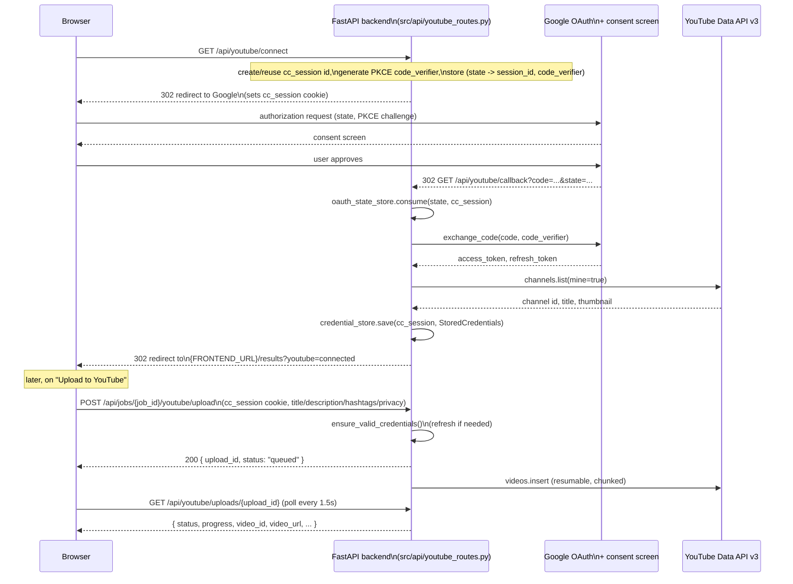

# YouTube (Connect + Upload)

ClipContext can optionally connect to a user's YouTube channel and publish
the generated video with its selected title, description, and hashtags
directly. This is a raw Google OAuth 2.0 **web-server flow**, scoped only
for the YouTube Data API v3 — it is entirely separate from the Firebase-based
ClipContext account system described in [Firebase.md](Firebase.md). Every
other part of ClipContext (upload, processing, results) works with zero
YouTube configuration; connecting a channel is opt-in per browser session.

## This is a separate identity system from ClipContext accounts

| | Connect with YouTube | ClipContext account login |
|---|---|---|
| Purpose | Authorizes ClipContext to upload videos to *a* channel | Identifies *you* to save/retrieve artifacts |
| Technology | Raw Google OAuth 2.0 web-server flow | Firebase Authentication (Google provider) |
| Identity | YouTube channel, via an opaque `cc_session` cookie | Firebase UID |
| Where it's checked | `cc_session` HttpOnly cookie | `Authorization: Bearer <Firebase ID token>` header |
| Backend module | `src/youtube/`, `src/api/youtube_routes.py` | `src/firebase/`, `src/api/auth_dependencies.py` |
| Storage | In-memory `credential_store` (`src/youtube/token_store.py`), lost on backend restart | Firestore (`users/{uid}`), persistent |

The code treats these as unrelated identities on purpose. `src/api/
artifact_routes.py`'s `_safe_youtube_metadata()` looks up YouTube upload
status via the `cc_session` cookie *independently* of the Firebase-
authenticated user making the artifacts request — its own comment says so:
"entirely independent of the Firebase-authenticated user — a ClipContext
account and a YouTube connection are not the same identity." Similarly,
`frontend/context/AuthContext.tsx` and `frontend/components/AccountControl.tsx`
both note that a user can be logged into ClipContext with one Google account
while having authorized YouTube uploads through a completely different one.
Merging the two would conflate "who is browsing ClipContext" with "which
channel receives this upload" — two genuinely different questions, since the
account saving artifacts and the channel receiving a video are not
guaranteed (or required) to belong to the same person.

## Session identity: `cc_session`

There is no ClipContext-account requirement to connect YouTube. Instead,
`src/youtube/session.py` issues an opaque, cryptographically random,
HttpOnly `cc_session` cookie (`secrets.token_urlsafe(32)`, 30-day max age)
the first time a browser hits `/api/youtube/connect`. Every YouTube
credential and upload lookup on the backend is keyed strictly by this
session id — it binds "this browser" to "these YouTube credentials" without
one global token shared across all visitors, and without requiring any
other login. Credentials are stored server-side only
(`src/youtube/token_store.py`, in-memory, thread-safe) and are never
returned to the browser.

Cookie behavior is configurable for cross-origin production deployments via
`COOKIE_SECURE` (default `false`) and `COOKIE_SAMESITE` (default `lax`).
`SameSite=None` is rejected by browsers unless `Secure` is also set;
`set_session_cookie()` enforces that pairing automatically
(`secure = get_cookie_secure() or samesite == "none"`), but both should still
be set explicitly in a production `.env`.

## Scopes

Configurable via `GOOGLE_OAUTH_SCOPES`; the default
(`src/config.py`'s `DEFAULT_GOOGLE_OAUTH_SCOPES`) is:

```
https://www.googleapis.com/auth/youtube.upload
https://www.googleapis.com/auth/youtube.readonly
```

`youtube.upload` alone is the narrowest scope for `videos.insert`, but the
live YouTube Data API rejects `channels.list(mine=true)` under that scope
alone with a `403 insufficientPermissions` — `youtube.readonly` is included
so the app can look up and display the connected channel's name/thumbnail.
This is still well short of the broad `youtube` (manage account) scope.

## OAuth + PKCE flow

`src/youtube/oauth.py` uses `google-auth-oauthlib`'s `Flow` for the
authorization-code exchange (no hand-rolled OAuth cryptography), with PKCE:
a `code_verifier` is generated once per connect attempt
(`generate_code_verifier()`) and threaded through both the authorization URL
and the token exchange, stored server-side alongside the CSRF `state` value
in `src/youtube/state_store.py`. That state store is single-use — `consume()`
pops the entry so a replayed callback (back/forward navigation, or a
captured/replayed URL) fails on a second attempt — and entries expire after
`OAUTH_STATE_TTL_SECONDS` (10 minutes) so an abandoned OAuth attempt can't be
resurrected later.



The callback (`GET /api/youtube/callback`) always redirects the browser back
to `${FRONTEND_URL}/results`, either with `?youtube=connected` or
`?youtube=error&code=<YouTubeErrorCode>` — the frontend's
`YouTubeUploadPanel.tsx` reads and strips these query params once, then
refreshes connection status. Because this is a full-page redirect, it
remounts the whole React tree; see [Frontend.md](Frontend.md)'s explanation
of the `hydrated` flag in `VideoSessionContext` for why that matters to the
`/results` page's session handling.

Token refresh happens transparently: `ensure_valid_credentials()`
(`src/youtube/oauth.py`) refreshes an expired access token using the stored
refresh token before each upload. If the refresh token itself is invalid or
revoked (Google's `invalid_grant`), it raises `YouTubeReconnectRequired`; the
stale credentials are discarded server-side and the upload fails with the
`YOUTUBE_RECONNECT_REQUIRED` error code, which the frontend maps to a
"Reconnect YouTube" call to action.

## Upload path

`POST /api/jobs/{job_id}/youtube/upload` (`src/api/youtube_routes.py`):

1. Requires the `cc_session` cookie to resolve stored credentials (`401
   YOUTUBE_NOT_CONNECTED` otherwise).
2. Requires the ClipContext job to exist and be `COMPLETED` (`404
   JOB_NOT_FOUND` / `409 JOB_INCOMPLETE`).
3. Resolves the original video file path server-side from `job_id` via
   `resolve_upload_video_path()` — the browser never supplies a filesystem
   path (`404 VIDEO_SOURCE_MISSING` if it's gone, e.g. after cleanup).
4. Rejects a duplicate concurrent upload for the same session+job (`409
   YOUTUBE_UPLOAD_IN_PROGRESS`), via `upload_registry.find_active()`.
5. Creates an `UploadRecord`, starts `run_youtube_upload()` on a background
   daemon thread, and returns `{ upload_id, status: "queued" }` immediately.

`src/youtube/upload.py`'s `run_youtube_upload()` does the actual work: builds
the request body via `src/youtube/metadata.py`'s `build_upload_body()`
(title/description/hashtags/privacy/made-for-kids, truncated to the YouTube
Data API's documented limits — 100 chars title, 5000 chars description —
regardless of what the frontend already enforces), then uses
`googleapiclient.http.MediaFileUpload(..., resumable=True)` in 8MB chunks
(`UPLOAD_CHUNK_SIZE`) with `next_chunk()` progress reporting, so the video
file is never read fully into memory. Transient `5xx` errors are retried
with bounded exponential backoff (up to `MAX_UPLOAD_RETRIES = 8`); other
`HttpError`s are classified into specific `YouTubeErrorCode`s (quota
exceeded, API not enabled, insufficient scope, etc.) via
`_classify_http_error()`. Hashtags are appended to the description with
clean spacing and separately turned into deduplicated YouTube tags (leading
`#` stripped) — `generated_content.json` itself is never mutated; the upload
body is built fresh each time.

Progress is polled by the frontend via `GET /api/youtube/uploads/{upload_id}`
(`useYouTubeUploadPolling.ts`, every 1.5s, same pattern as job-status
polling — see [Frontend.md](Frontend.md)), scoped so only the session that
created an upload can see its status.

## Privacy default: "Private," not enforced server-side

The `videos.insert` request requires an explicit `privacyStatus`
(`private` / `unlisted` / `public`) — the backend's
`YouTubeUploadRequest` schema (`src/youtube/schemas.py`) has no default for
`privacy_status`; it must be supplied on every request. The **frontend**
supplies the safety net: `YouTubeUploadPanel.tsx` initializes its
`privacyStatus` state to `"private"` (`useState<YouTubePrivacyStatus>("private")`),
so a user has to deliberately open the "Privacy" dropdown and pick
"Unlisted" or "Public" to change it. On top of that, clicking "Upload to
YouTube" never fires the request directly — it only opens a confirmation
step (`awaitingConfirmation`) that restates exactly what's about to be
published, including the chosen privacy status in bold, before "Confirm &
Upload" actually calls `createYouTubeUpload()`.

There is no code-level restriction preventing a `public` upload on someone's
very first connection — a user can pick "Public" on their first try. The
safety rule that exists is a UX default plus a mandatory confirmation step,
not a backend-enforced constraint. The project's own operational guidance
(`README.md`'s "Local testing checklist") is to always test the first real
upload with `privacy_status: "private"` and not switch to Public until
end-to-end behavior is confirmed — a process recommendation, not something
the API enforces.

Audience declaration (`made_for_kids`) works the same way: the frontend's
upload button (`canUpload`) stays disabled until the user has explicitly
chosen "Yes" or "No" (`madeForKids !== null`) — there is no default value —
mapping to the YouTube Data API's `status.selfDeclaredMadeForKids` field.

## Setting up your own OAuth client (Google Cloud Console)

1. Open [Google Cloud Console](https://console.cloud.google.com/) and select
   (or create) a project. You can reuse the same project used for
   `YOUTUBE_API_KEY` if you have one.
2. **APIs & Services → Library** — search for and enable **YouTube Data API
   v3**, if not already enabled.
3. **APIs & Services → OAuth consent screen** (may show as "Google Auth
   Platform") — configure it: app name ("ClipContext" or similar), a support
   email, and an audience (**External**, unless you're on Google Workspace
   and only need internal users).
4. **APIs & Services → Credentials → Create Credentials → OAuth client ID.**
   - Application type: **Web application**.
   - Authorized redirect URIs — add the backend's callback URL **exactly**:
     - Local dev: `http://localhost:8000/api/youtube/callback`
     - Production: `https://<your-deployed-backend-host>/api/youtube/callback`
       (add this as a *second* redirect URI alongside the localhost one, so
       local dev keeps working too — it must exactly match your deployed
       backend's host and the `/api/youtube/callback` path, not a guess).
   - Authorized JavaScript origins: not required — the OAuth flow is
     server-to-server from the backend; the browser never calls Google's
     OAuth endpoints directly.
5. Copy the generated **Client ID** and **Client secret** into the backend's
   root `.env` (not `frontend/.env.local` — the frontend never sees these):
   ```
   GOOGLE_CLIENT_ID=...
   GOOGLE_CLIENT_SECRET=...
   GOOGLE_OAUTH_REDIRECT_URI=http://localhost:8000/api/youtube/callback
   ```
   Never paste these into chat, source files, or `.env.example`.

If any of `GOOGLE_CLIENT_ID`, `GOOGLE_CLIENT_SECRET`, or
`GOOGLE_OAUTH_REDIRECT_URI` is unset, `is_youtube_oauth_configured()`
(`src/config.py`) returns `false`, and `GET /api/youtube/connect` returns a
structured `503 YOUTUBE_OAUTH_NOT_CONFIGURED` instead of attempting the
flow — everything else in ClipContext still works.

### Testing vs. Publishing mode — a real gotcha

While the OAuth consent screen is in **Testing** mode (the default for a new
OAuth client), **only Google accounts explicitly added as Test users** can
complete the connect flow — Google rejects OAuth for every other account
with an access-denied error, regardless of how correctly the rest of the
setup is done. Add every Google account you'll use to test the connect flow
under **OAuth consent screen → Test users** (step 3 above).

Moving to **Production**/**Published** (required before arbitrary public
users can connect) is a separate Google app-verification process,
particularly relevant for the `youtube.upload` scope — consult Google's
current OAuth verification requirements before a public launch. Until then,
anyone not on the Test users list will be turned away at Google's consent
screen, which is easy to mistake for a ClipContext bug.

## Environment variables

| Variable | Required | Notes |
|---|---|---|
| `GOOGLE_CLIENT_ID` / `GOOGLE_CLIENT_SECRET` | For the YouTube feature | From the OAuth client created above. Without these, `/api/youtube/connect` returns `YOUTUBE_OAUTH_NOT_CONFIGURED`; everything else still works. |
| `GOOGLE_OAUTH_REDIRECT_URI` | For the YouTube feature | Must exactly match an Authorized redirect URI on the OAuth client. Local default: `http://localhost:8000/api/youtube/callback`. |
| `GOOGLE_OAUTH_SCOPES` | Optional | Space- or comma-separated. Defaults to `youtube.upload` + `youtube.readonly` (see "Scopes" above). |
| `FRONTEND_URL` | Optional (default `http://localhost:3000`) | Where the OAuth callback redirects the browser after completing (`/results?youtube=connected` or `?youtube=error&code=...`). |
| `COOKIE_SECURE` | Optional (default `false`) | Set `true` in production if frontend/backend are on different origins. |
| `COOKIE_SAMESITE` | Optional (default `lax`) | Set `none` in production if frontend/backend are on different origins (requires `COOKIE_SECURE=true` too). |

For a cross-origin production deployment (e.g. frontend on Vercel, backend
on Railway/Fly/Cloud Run), set:

```
COOKIE_SECURE=true
COOKIE_SAMESITE=none
GOOGLE_OAUTH_REDIRECT_URI=https://<your-backend-host>/api/youtube/callback
FRONTEND_URL=https://<your-frontend-host>
ALLOWED_ORIGINS=https://<your-frontend-host>
```

See [Environment.md](Environment.md) for the full environment variable list
across the whole app, and [Firebase.md](Firebase.md) for the unrelated
ClipContext-accounts credential setup.
